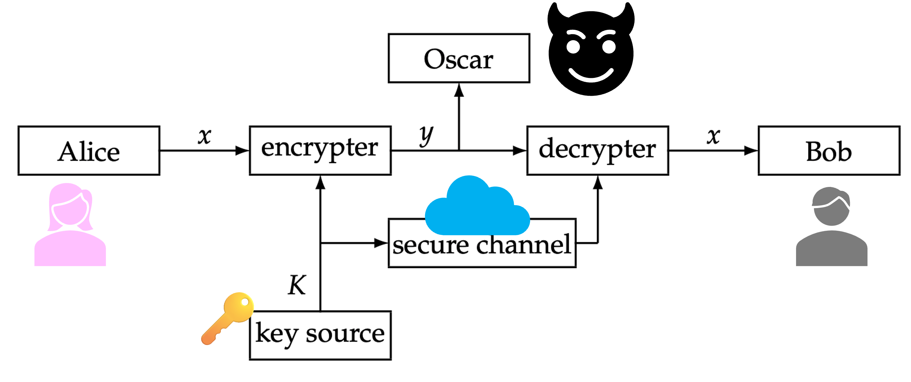

> [!Caution] 声明
> 笔记内容基于上海交通大学的《现代密码学1》课程，主要内容是关于密码学和计算机安全的相关知识。文中使用的代码示例和图像均来自课程资料，版权归原作者所有。本笔记旨在帮助学习者更好地理解课程内容，任何转载或引用请注明出处，不涉及商业用途。如有任何版权问题，请联系我进行处理。

## 信息安全的核心挑战

在网络世界中，信息面临着多种多样的威胁，我们需要相应的安全服务来应对。我们将威胁与对应的防御目标（安全服务）进行对比：

    <table style="border-collapse: collapse; width: 100%; border-top: 2px solid black; border-bottom: 2px solid black;">
    <thead>
        <tr style="border-bottom: 1px solid black;">
        <th style="padding: 12px 8px; text-align: center;">安全威胁</th>
        <th style="padding: 12px 8px; text-align: center;">对应的安全要求 (Security Services)</th>
        <th style="padding: 12px 8px; text-align: center;">定义描述</th>
        </tr>
    </thead>
    <tbody>
        <tr>
        <td style="padding: 10px 8px;"><strong>窃听</strong></td>
        <td style="padding: 10px 8px;">机密性 (Confidentiality)</td>
        <td style="padding: 10px 8px;">确保信息不被非授权泄露。</td>
        </tr>
        <tr>
        <td style="padding: 10px 8px;"><strong>篡改</strong></td>
        <td style="padding: 10px 8px;">完整性 (Integrity)</td>
        <td style="padding: 10px 8px;">确保信息在传输中未被非法修改。</td>
        </tr>
        <tr>
        <td style="padding: 10px 8px;"><strong>拒绝服务</strong></td>
        <td style="padding: 10px 8px;">可用性 (Availability)</td>
        <td style="padding: 10px 8px;">确保合法用户能及时获得服务。</td>
        </tr>
        <tr>
        <td style="padding: 10px 8px;"><strong>行为否认</strong></td>
        <td style="padding: 10px 8px;">不可否认性 (Non-repudiation)</td>
        <td style="padding: 10px 8px;">发送方或接收方无法抵赖已发生的行为。</td>
        </tr>
        <tr>
        <td style="padding: 10px 8px;"><strong>伪造</strong></td>
        <td style="padding: 10px 8px;">身份鉴别 (Identification)</td>
        <td style="padding: 10px 8px;">确认通信双方真实身份。</td>
        </tr>
    </tbody>
    </table>

除了上述核心点，现代安全体系还包括 **消息认证 (Message Authentication)** 和 **访问控制 (Access Control)**。

## 密码学核心术语

### 基础定义
* **密码 (Cryptography)**：指采用特定变换的方法对信息进行加密保护、安全认证的技术、产品和服务。
* **密码技术**：研究如何设计算法，也称“密码编码学”。
* **密码分析**：研究如何破解密码或寻找安全漏洞。
* **密码体制**：一套完整的密码算法流程。

### 常用术语
* **明文 (Plaintext, $p$)**：原始信息。
* **密文 (Ciphertext, $c$)**：加密后的信息。
* **密钥 (Key, $k$)**：加解密的关键参数。
* **加密 (Encryption, $E$)**：$p \rightarrow c$ 的过程。
* **解密 (Decryption, $D$)**：$c \rightarrow p$ 的过程。

### 密码算法的基本模型

## 密码体制的数学模型

一个完整的密码体制可以用五元组 $(\mathcal{P}, \mathcal{C}, \mathcal{K}, E, D)$ 来描述：

1.  $\mathcal{P}$：**明文空间**（所有可能明文的有限集合）。
2.  $\mathcal{C}$：**密文空间**（所有可能密文的有限集合）。
3.  $\mathcal{K}$：**密钥空间**（所有可能密钥的有限集合）。
4.  $E$：**加密算法**，定义为 $E: \mathcal{K} \times \mathcal{P} \rightarrow \mathcal{C}$。
5.  $D$：**解密算法**，定义为 $D: \mathcal{K} \times \mathcal{C} \rightarrow \mathcal{P}$。

> [!important] 正确性条件
> 对于所有密钥 $k \in \mathcal{K}$，必须满足：
> $$D_k(E_k(p)) = p$$
> 意味着使用相同密钥（或对应密钥）加密后再解密，必须能还原出原始明文。

## 核心设计原则与安全准则

### Kerckhoffs 原则 (柯克霍夫原则)
> [!caution] 核心思想
> **密码体制的安全性不应依赖于算法的保密，而应仅依赖于密钥的保密。**
> 
> 在现代密码学中，算法通常是公开透明的，接受全世界专家的“围攻”以证明其强度。

### 安全等级分类
* **无条件安全 (Unconditional Security)**：无论攻击者拥有多少计算资源，都无法破解（如：一次一密 One-Time Pad）。
* **计算安全 (Computational Security)**：破解该算法所需的计算资源超出了人类目前的极限（例如需要最强计算机运行上万年）。

## 常见的攻击模型

根据攻击者掌握的信息量，攻击模型分为以下四个等级（强度递增）：

1.  **唯密文攻击 (COA)**：仅知道一些密文。难度最高，依赖统计分析。
2.  **已知明文攻击 (KPA)**：掌握部分明文及其对应的密文。
3.  **选择明文攻击 (CPA)**：攻击者可以指定明文并获取其密文（常用于分析公钥加密）。
4.  **选择密文攻击 (CCA)**：攻击者可以指定密文并获取其明文。这是最严苛的模型。

## 密码算法的分类

根据密钥的特性和处理方式，我们可以将算法分为三大类：

### 对称加密算法 (Symmetric-key)
加密和解密使用**同一个密钥**。
* **分组密码 (Block Cipher)**：按固定长度分块。如：**AES**, **DES**, **SM4**。
* **流密码 (Stream Cipher)**：逐位/逐字节连续处理。如：**RC4**, **ZUC**。
* **优点**：效率极高。
* **缺点**：存在密钥分发和管理难题。

### 公钥加密算法 (Asymmetric-key)
使用**公钥加密，私钥解密**。
* 常见算法：**RSA**, **ECC**, **SM2**。
* 解决问题：无需预先共享密钥，方便身份认证。

### 哈希函数 (Hash Function)
将任意输入映射为固定长度输出。
* 特性：单向性（不可逆）、抗碰撞性。
* 常见算法：**SHA-256**, **SM3**, **MD5**。

## 密码分析：攻防的艺术

密码分析是评估算法强度的重要手段。常用的攻击手段包括：
* **暴力攻击 (Brute-force)**：遍历密钥空间。
* **数学攻击**：
    * **统计分析**：利用语言或数据的统计特性。
    * **差分/线性攻击**：针对算法内部结构的深度数学分析。

