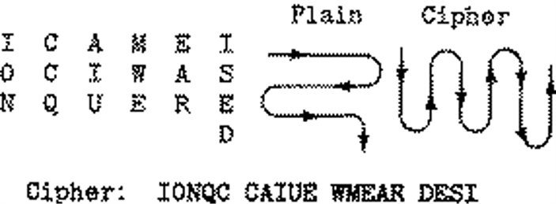

> [!Caution] 声明
> 笔记内容基于上海交通大学的《现代密码学1》课程，主要内容是关于密码学和计算机安全的相关知识。文中使用的代码示例和图像均来自课程资料，版权归原作者所有。本笔记旨在帮助学习者更好地理解课程内容，任何转载或引用请注明出处，不涉及商业用途。如有任何版权问题，请联系我进行处理。
古典密码可以分为两大类：代换密码和置换密码。代换密码是将明文中的每个字母替换为另一个字母，而置换密码则是重新排列明文中的字母顺序。

## 古典代换密码

### 凯撒密码

凯撒密码的加密方法是将字母表中的每个字母替换为其后面第n个字母。例如，如果n=3，那么A将被替换为D，B将被替换为E，以此类推。凯撒密码的解密方法是将加密后的字母表中的每个字母替换回原来的字母。

凯撒密码的一般形式为移位密码，密码体制如下：

令 $\mathcal{P} = \mathcal{C} = \mathcal{K} = \{0, 1, 2, \ldots, 25\}$，其中 $0$ 表示字母A，$1$ 表示字母B，以此类推。对于每个密钥 $k \in \mathcal{K}$，定义加密算法 

$$E_k(p) = (p + k) \mod 26$$ 

和解密算法 

$$D_k(c) = (c - k) \mod 26$$

当 $k=3$ 时，即为经典的凯撒密码。

### 混合单表代换密码

混合单表代换密码将每一个字母替换为另一个字母，但替换规则不再是简单的移位，而是通过一个混乱的映射来实现。例如，A可能被替换为Q，B可能被替换为W，以此类推。混合单表代换密码的加密和解密算法与凯撒密码类似，但使用了一个更复杂的替换规则，因而他的密钥长度为26个字母。

例如我们有如下规则：

<div style="text-align: center;">
明文： ABCDEFGHIJKLMNOPQRSTUVWXYZ 

密文： DKVQFIBJWPESCXHTMYAUOLRGZN 
</div>

假如我们有这段密文： 
<div style="text-align: center;">
WIRFRWAJUHYFTSDVFSFUUFYA
</div>
那么我们可以通过上述替换规则将其解密为明文
<div style="text-align: center;">
IFWEWISHTOREPLACELETTERS
</div>


### 简单代表代换密码

混合单表代换密码需要有26位的密钥来描述替换规则，我们需要一种更简洁的方式来描述替换规则。简单代表代换密码通过使用一个较短的关键词来生成完整的替换规则。一种简单方法是写没有重复字母的“密钥字”，其他字母按顺序写在密钥字最后字母后。

例如给定密钥字“JULISCAER”，那么它对应的完整版混合单表代换密码的密钥就是：

<div style="text-align: center;">
明文： ABCDEFGHIJKLMNOPQRSTUVWXYZ

密文： JULISCAERTVWXYZBDFGHKMNOPQ
</div>

### 维吉尼亚密码

维吉尼亚密码使用一个关键词来控制每个字母的替换方式。对于每个明文字母，使用关键词中对应位置的字母来确定替换规则。因此，每个字母可以被多种字母进行替换。

他的密码体制定义如下：

设 $m$ 是一个正整数。定义 $\mathcal{P} = \mathcal{C} = \mathcal{K} = \mathbb{Z}_{26}$。对任意的密钥 $K = (k_1, k_2, \dots, k_m)$，定义：

$$e_K(x_1, x_2, \dots, x_m) = (x_1 + k_1, x_2 + k_2, \dots, x_m + k_m)$$

和

$$d_K(y_1, y_2, \dots, y_m) = (y_1 - k_1, y_2 - k_2, \dots, y_m - k_m)$$

以上所有运算都是在 $\mathbb{Z}_{26}$ 上进行。每次加密 $m$ 个字母时，使用密钥中的 $m$ 个字母进行加密。对于明文中的第 $i$ 个字母，使用密钥中的第 $((i-1) \mod m) + 1$ 个字母来确定替换规则。

## 古典置换密码

置换密码的本质就是对明文中的字母进行重新排列。他的密码体制可以归纳如下：

令 $m$ 为一正整数。$\mathcal{P} = \mathcal{C} = (\mathbb{Z}_{26})^m$，$\mathcal{K}$ 是由所有定义在集合 $\{1, 2, \dots, m\}$ 上的置换组成。对任意的密钥（即置换）$\pi$，定义：

$$e_{\pi}(x_1, x_2, \dots, x_m) = (x_{\pi(1)}, x_{\pi(2)}, \dots, x_{\pi(m)})$$

和

$$d_{\pi}(y_1, y_2, \dots, y_m) = (y_{\pi^{-1}(1)}, y_{\pi^{-1}(2)}, \dots, y_{\pi^{-1}(m)})$$

### 轨道栅栏密码

轨道栅栏密码通过将明文中的字母按照一定的规则重新排列来实现加密。例如，如果我们使用一个2轨道的栅栏，那么我们将明文中的字母分成两行，第一行包含第1、3、5...个字母，第二行包含第2、4、6...个字母。然后我们将两行的字母连接起来形成密文。

比如说明文是“ICAMEISAWICONQUERED”，分成两行以后变成：

<div style="text-align: center;">
I A E S W C N U R D

C M I A I O Q E E
</div>

密文也就是“IAESW CNURD CMIAI OQEE”。

### 几何图形密码

几何图形密码通过将明文中的字母按照一定的几何图形进行排列来实现加密。例如，我们可以将明文中的字母按照一个矩形的方式排列，然后按照一定的顺序读取这些字母来形成密文。



### 行变换密码

行变换密码是置换密码的一种典型实现。它的核心逻辑是不改变字母的“身份”，只打乱字母的“位置”：将明文按固定长度分组并按行书写，随后按预设密钥的顺序打乱每一行，最后读取形成密文。

令分组长度（周期）为 $m$。定义明文和密文空间为 $\mathcal{P} = \mathcal{C} = (\mathbb{Z}_{26})^m$。密钥 $\pi$ 是定义在集合 $\{1, 2, \dots, m\}$ 上的一个置换。
- 加密运算：$e_{\pi}(x_1, x_2, \dots, x_m) = (x_{\pi(1)}, x_{\pi(2)}, \dots, x_{\pi(m)})$
- 解密运算：$d_{\pi}(y_1, y_2, \dots, y_m) = (y_{\pi^{-1}(1)}, y_{\pi^{-1}(2)}, \dots, y_{\pi^{-1}(m)})$

对于加密运算，有两种给出加密密钥的方法，一种是直接给出数字密钥，比如说下面这个例子：

明文：THESIMPLESTPOSSIBLETRANSPOSITIONSXX

加密密钥 $W$：4 1 5 3 2 （即第1个位置放原第4个字符，第2个放原第1个...）

解密密钥 $R$：2 5 4 1 3

```
[原始行]       [按 W 变换后的行]
T H E S I  -->  S T I E H
M P L E S  -->  E M S L P
T P O S S  -->  S T S O P
I B L E T  -->  E I T L B
R A N S P  -->  S R P N A
O S I T I  -->  T O I I S
O N S X X  -->  X O X S N
```

密文：STIEH EMSLP STSOP EITLB SRPNA TOIIS XOXSN

第二个方法是直接给出字母密钥，比如说下面这个例子：

明文：ACONVENIENTWAYTOEXPRESSTHEPERMUTATION

密钥单词：COMPUTER ($W = 1,4,3,5,8,7,2,6$)

如果最后一组长度不足，通常需要进行填充（Padding），例如补充 Z 来使得最后一组达到 $m$ 的长度。

```
[原始行]              [按 W 变换后的行]
A C O N V E N I  -->  A N O V I N C E
E W T A O T N Y  -->  E W T A O T N Y
E R P E T S X S  -->  E R P E T S X S
H E P R T U E M  -->  H E P R T U E M
A O I N Z Z T Z  -->  A O I N Z Z T Z
```

密文: ANOVI NCEEW TAOTN YERPE TSXSH EPRTU EMAOI NZZTZ 

