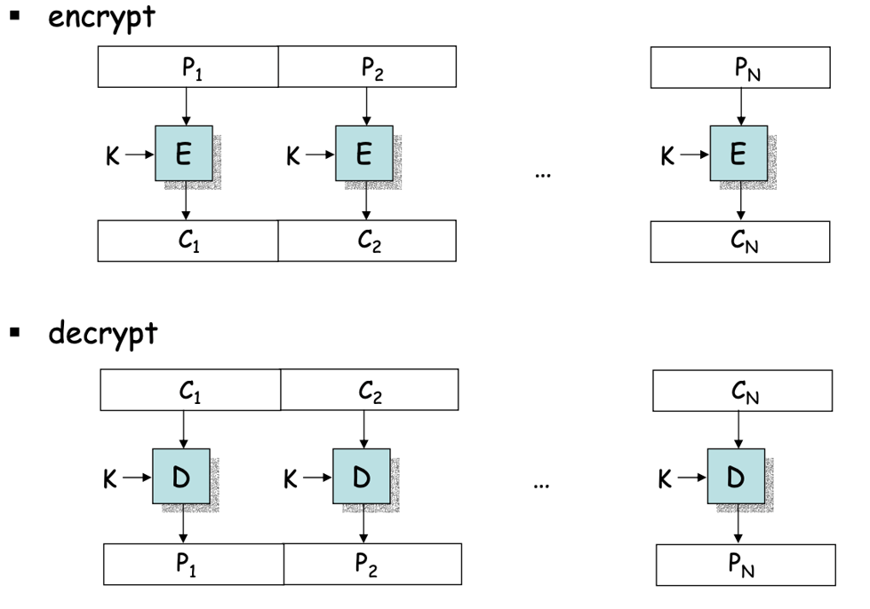
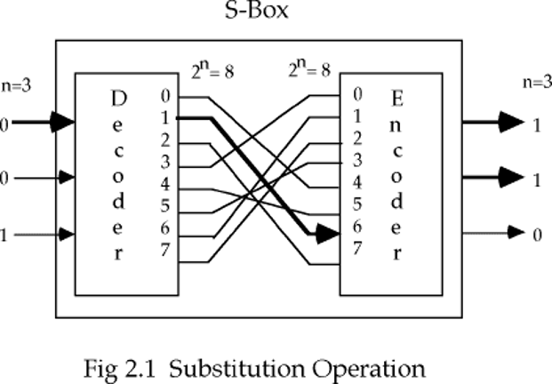
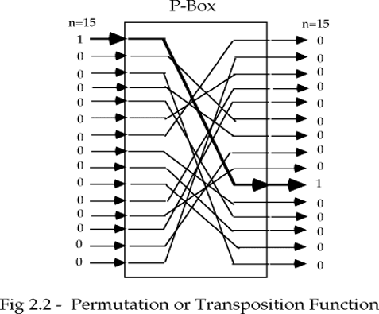
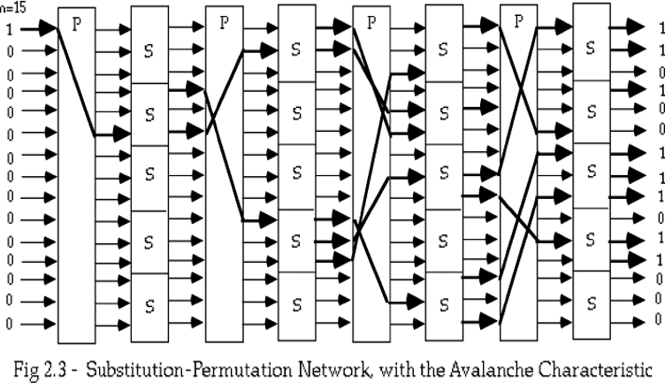
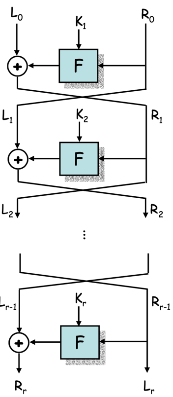
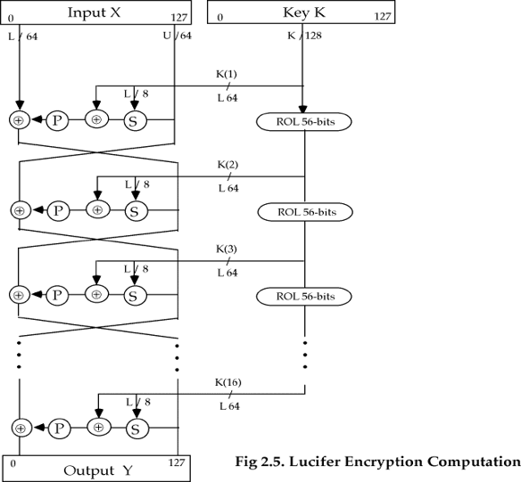
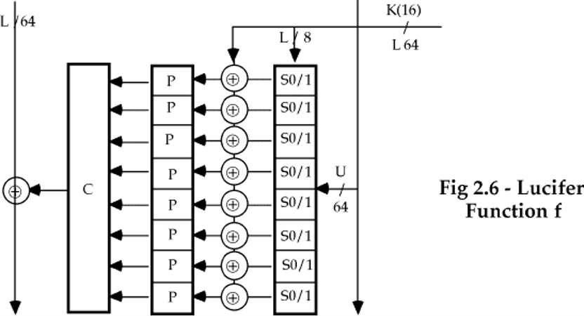

> [!Caution] 声明
> 笔记内容基于上海交通大学的《现代密码学1》课程，主要内容是关于密码学和计算机安全的相关知识。文中使用的代码示例和图像均来自课程资料，版权归原作者所有。本笔记旨在帮助学习者更好地理解课程内容，任何转载或引用请注明出处，不涉及商业用途。如有任何版权问题，请联系我进行处理。
对称加密算法有两大类：分组密码 (Block Cipher)和流密码 (Stream Cipher)。分组密码是目前最流行的加密算法，常见的有如下几种：

| 算法 | 首发年份 | 分组长度 (bits) | 密钥长度 (bits) |
| :--- | :---: | :---: | :---: |
| **DES** | 1975 | 64 | 56 |
| **Triple DES (3DES)** | 1981 | 64 | 112, 168 |
| **IDEA** | 1991 | 64 | 128 |
| **Blowfish** | 1993 | 64 | 32 - 448 |
| **AES** | 1998 | 128 | 128, 192, 256 |
| **Camellia** | 2000 | 128 | 128, 192, 256 |
| **ARIA** | 2003 | 128 | 128, 192, 256 |
| **SM4** | 2006 | 128 | 128 |

分组密码将消息分成很多块，每一块都会进行加密。

## 代换-置换密码 (SPN)

代换-置换密码 (Substitution-Permutation Network, SPN) 是分组密码的一种设计方法。它通过多轮的代换和置换操作来实现加密。每一轮都包含一个代换层和一个置换层，代换层负责将输入的位进行替换，而置换层负责将输入的位进行重新排列。

代换运算 (S-Box) 将一个二进制字用另一个二进制字进行替换，这种代换函数就是一种密钥。代换运算提供输入比特的非线性变换，是分组密码中实现混淆的关键组件。其目的在于使作用于明文的密钥和密文之间的关系复杂化，使明文和密文之间、密文和密钥之间的统计相关特性极小化，从而使统计分析攻击不能奏效。

置换运算 (P-Box) 将输入的位进行重新排列，这种置换函数也是一种密钥。置换运算提供扩散作用，将明文及密钥的影响尽可能迅速地散布到较多个输出的密文中（将明文冗余度分散到密文中）。

将这两种运算结合起来，就可以构建一个代换-置换网络。

在实际使用的SPN中，由于我们同时需要加密与解密，我们可以选择定义每一个代换与置换的逆运算，不过这种计算的复杂度比较高。一个更好的方法是定义一种易于求逆的结构，这样可以使用基本的相同编码或硬件用于加密和解密。

## 雪崩性与完备性

雪崩性与完备性是分组密码设计中的两个重要原则。雪崩性要求输入的一个比特的改变会导致输出的近一半比特发生改变，他的严格定义如下：

> [!IMPORTANT] 雪崩效应
> 一个函数具有良好的雪崩特性是指：对于 $2^m$ 个明文向量，分为 $2^{m-1}$ 个向量对 $(x_i, x_i')$，其中 $x_i$ 和 $x_i'$ 只有一个比特不同。定义 $V_i = f(x_i) \oplus f(x_i')$，如果 $V_i$ 中近一半的比特为1，那么函数 $f$ 就具有良好的雪崩特性。

完备性要求输入的每一个比特都应该影响输出的每一个比特，每个输出比特是所有输入比特的复杂函数的输出，他的严格定义如下：

> [!IMPORTANT] 完备性效应
> 对于密文输出向量的每一比特 $j \in (0, m)$，至少存在一个明文对 $(x_i, x_i')$，使得 $x_i$ 和 $x_i'$ 只有第 $i$ 个比特不同，并且 $f(x_i)$ 和 $f(x_i')$ 的第 $j$ 个比特不同。

这些设计原理是设计好的分组密码的准则。“雪崩”保证小的输入变化导致大的输出变化，而完全性保证每个输出比特依赖于所有的输入比特。我们可以看到, 古典密码没有这些性质。

## Feistel网络

Feistel网络是一种特殊的分组密码结构，它将输入分成两半 $L(i - 1)$ 和 $R(i - 1)$，并在第 $i$ 轮中对 $R(i - 1)$ 进行加密操作，然后将结果与 $L(i - 1)$ 进行异或操作。Feistel网络的设计使得加密和解密过程非常相似，甚至可以使用相同的算法来实现。

<!-- 

    

 -->

用数学表示加密过程：

$$
\begin{cases}
L_i = R_{i-1} \\
R_i = L_{i-1} \oplus F(R_{i-1}, K_i)
\end{cases}
$$

Feistel网络的一个重要特点是它的加密和解密过程非常相似，甚至可以使用相同的算法来实现。这是因为Feistel网络的设计使得每一轮的加密操作都是可逆的，即使 $F$ 不是可逆的：

$$
\begin{cases}
R_{i-1} = L_i \\
L_{i-1} = R_i \oplus F(R_{i-1}, K_i)
\end{cases}
$$

对于Feistel网络的设计，需要考虑下列参数：

- 分组大小：增加分组大小，可以增加安全性，但也会增加加密和解密的计算复杂度。
- 轮数：增加轮数，可以增加安全性，但也会增加加密和解密的计算复杂度。
- 密钥大小：增加密钥大小，可以增加安全性，但也会增加加密和解密的计算复杂度。
- 子密钥生成算法：子密钥生成算法的设计需要保证生成的子密钥具有足够的随机性和不可预测性，以增加攻击者破解密码的难度。
- 轮函数 $F$ 的设计：轮函数 $F$ 的设计需要保证其具有良好的雪崩性和完备性，以增加攻击者破解密码的难度。

设计 “安全” 的密码算法并不难,  只要使用足够多的轮数就可以,但降低速度，但是得到一个快速/安全的算法是困难的。一个好的密码设计应该同时具有雪崩特性、完备性和不可预测性。

## Lucifer

Lucifer是Feistel网络的一个早期实现，是第一个可用的代换-置换密码，但是它可以使用差分密码分析进行攻击。他的整体结构如下：

<!-- 

    

 -->

Lucifer的分组长度是128位，密钥长度是128位，轮数是16轮。每一轮的轮函数 $F$ 包含一个S-Box和一个P-Box。每轮使用的子密钥是密钥的左半部分，而每次密码都需要左旋56比特，保证密钥的每一部分都参与运算。他的 $F$ 函数的设计如下：

<!-- 

    

 -->

每一轮的轮函数 $F$ 包含一个S-Box和一个P-Box。首先将收入的64位分成8个8比特分组，每个分组由一对4比特的S-Box进行代换，每个字节先由一个S-Box进行代换，然后由另一个S-Box进行代换。接下来将代换后的64位输入与子密钥进行异或操作，最后通过8个8比特的P-Box进行置换，得到64位的输出。