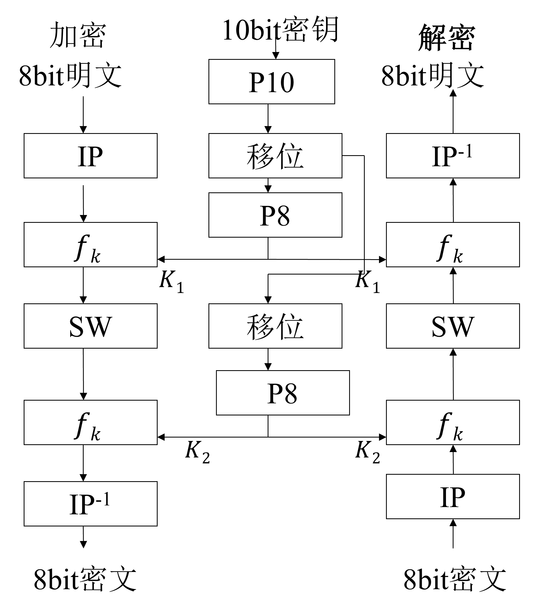
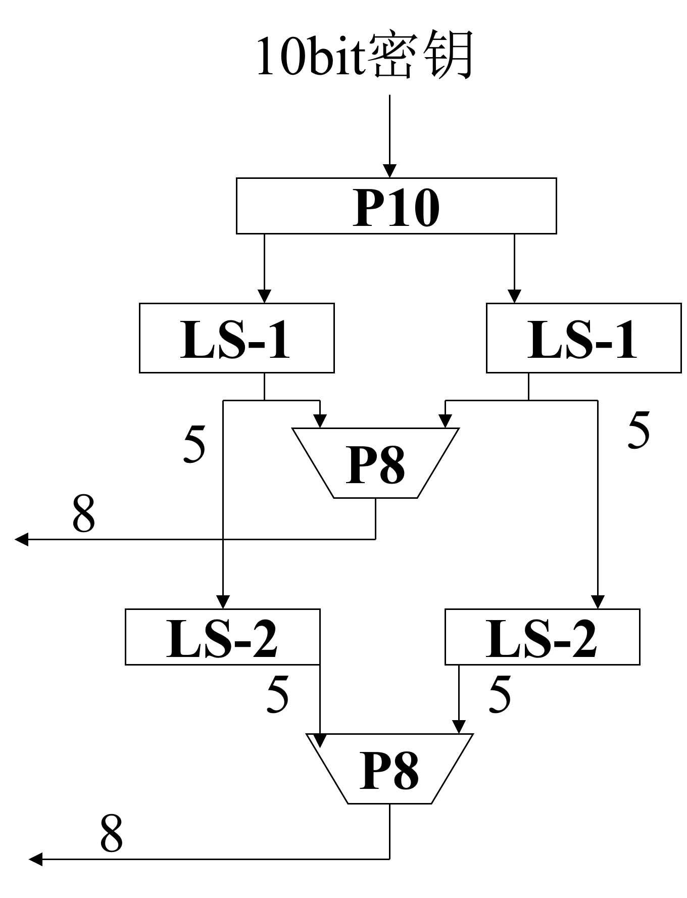
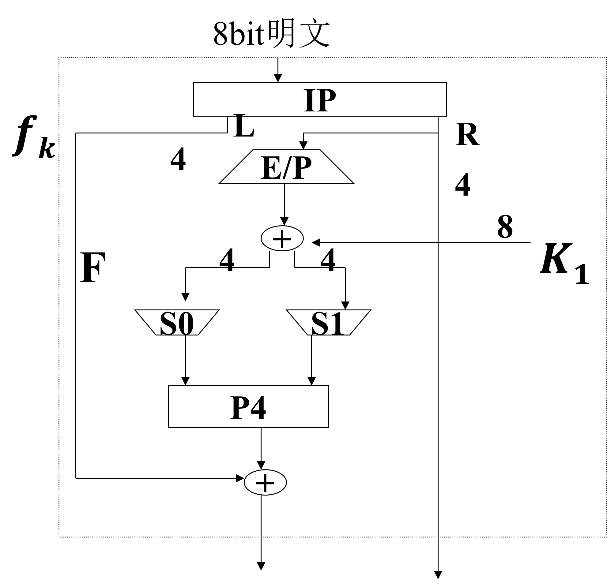
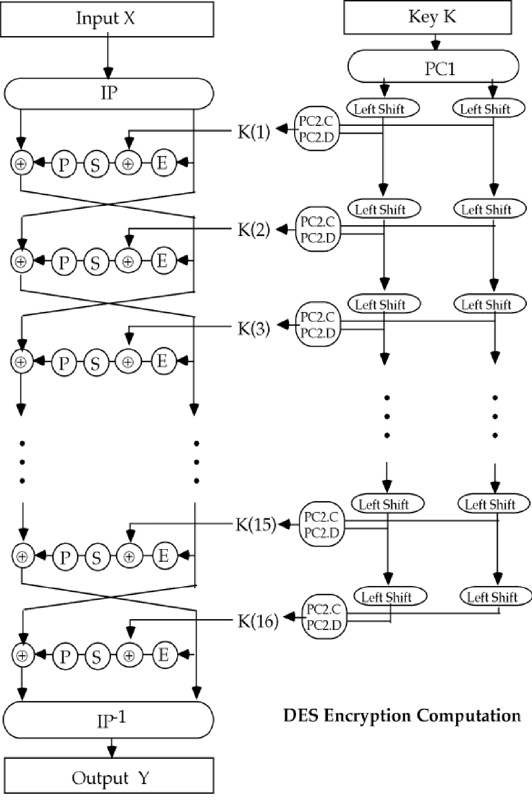
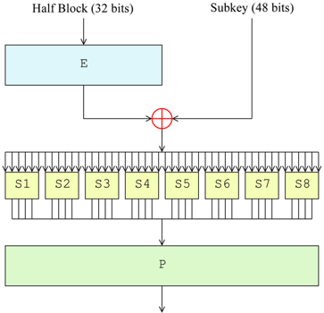
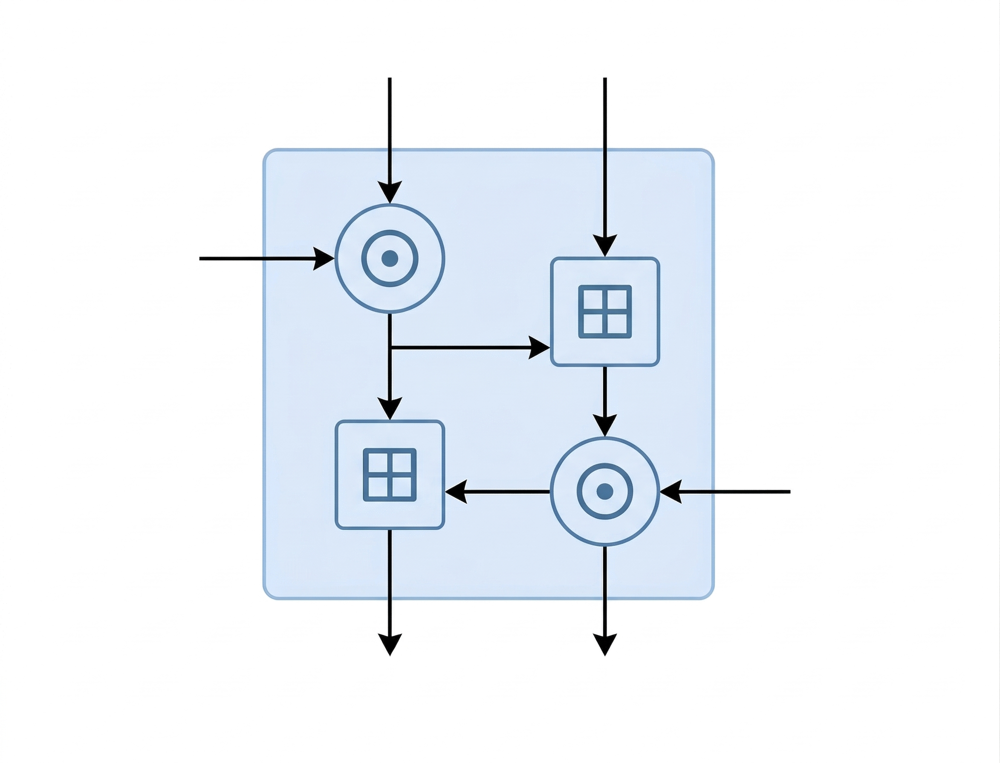
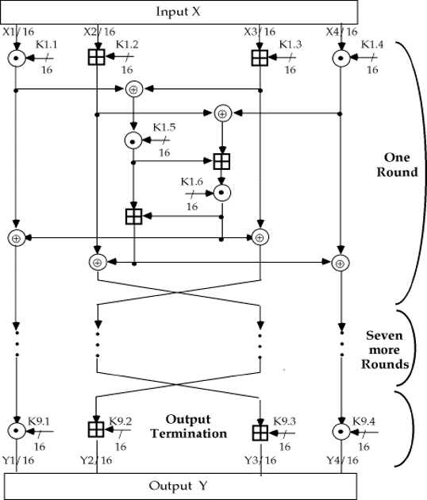
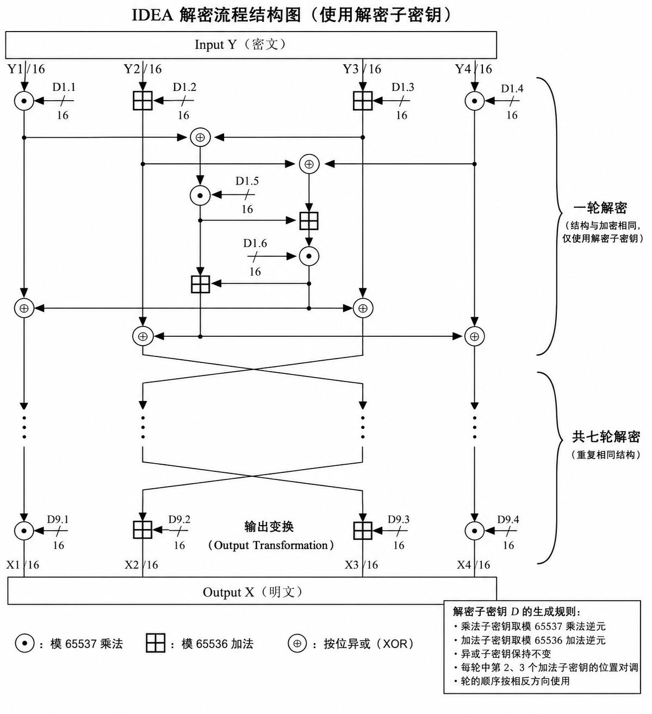

> [!Caution] 声明
> 笔记内容基于上海交通大学的《现代密码学1》课程，主要内容是关于密码学和计算机安全的相关知识。文中使用的代码示例和图像均来自课程资料，版权归原作者所有。本笔记旨在帮助学习者更好地理解课程内容，任何转载或引用请注明出处，不涉及商业用途。如有任何版权问题，请联系我进行处理。

## Simplified DES (S-DES)

Simplified DES 是一个教学用的简化版本的 DES，主要用于帮助理解分组密码的基本结构和原理。它使用 10 位密钥和 8 位明文，经过两轮 Feistel 结构的加密过程。

加密算法一共射击五个函数：
1. **初始置换 $IP$**：对输入的 8 位明文进行重新排列。
2. **复合函数 $f_{K_1}$**：使用第一个子密钥 $K_1$ 对数据进行处理。
3. **转换函数 $SW$**：交换左右两部分数据。
4. **复合函数 $f_{K_2}$**：使用第二个子密钥 $K_2$ 对数据进行处理。
5. **逆初始置换 $IP^{-1}$**：对处理后的数据进行逆置换，得到最终的密文。

如果用数学表达式来描述加密算法和解密算法，可以表示为：

$$\begin{aligned}
c &= IP^{-1}(f_{K_2}(SW(f_{K_1}(IP(p))))) \\
p &= IP^{-1}(f_{K_1}(SW(f_{K_2}(IP(c))))) \\
\end{aligned}$$

其中，子密钥 $K_1$ 和 $K_2$ 是从主密钥 $K$ 通过特定的密钥生成算法得到的：

$$\begin{aligned}
K_1 &= P_8 (Shift(P_{10} (K))) \\
K_2 &= P_8 (Shift(Shift(P_{10} (K))))
\end{aligned}$$

其中，$P_{10}$ 是一个 10 位的置换函数，$P_8$ 是一个 8 位的置换函数，$Shift$ 是一个循环左移函数，将密钥分成左右两部分后进行左移1位或者2位。

加密的复合函数 $f_K$ 的具体结构如下：

其中， $E/P$ 是一个扩展置换函数，将 4 位输入扩展为 8 位；$S_0$ 和 $S_1$ 是两个 S-盒，分别将第1、4比特的输入指定行，第2、3比特的输入指定列，输出 2 位，进行非线性运算；$P_4$ 是一个 4 位的置换函数。

如果用一个比较简洁的数学表达式来描述复合函数 $f_K$，可以表示为：

$$ f_K (L, R) = (L \oplus F(R, SK), R) $$

S-DES 的安全性如何呢？他的密钥空间有 $2^{10} = 1024$ 个可能的密钥。如果采用已知明文攻击，即我们已知明文 $(p_1, p_2, \ldots, p_n)$ 和对应的密文 $(c_1, c_2, \ldots, c_n)$，未知密钥 $(k_1, k_2, \ldots, k_{10})$，那么 $c_i$ 是 $p_j$ 和 $k_l$ 的函数关系，列出8个包含10个变量的非线性方程。由于 S-DES 的结构非常简单，攻击者可以通过穷举法（暴力破解）来尝试所有可能的密钥，或者通过分析已知明文和密文之间的关系来推断出密钥。因此，S-DES 并不适合实际使用，仅作为教学工具来帮助理解分组密码的基本原理。

## Data Encryption Standard (DES)

DES 是一种经典的分组密码算法，使用 56 位密钥 $K$ 和 64 位明文 $C$，经过 16 轮 Feistel 结构，得到 64 位密文 $D$。DES 的设计基于 S-DES 的基本原理，但在结构和参数上进行了大幅改进，以提高安全性。

DES 加密主要分成三个阶段：

1. **初始置换 $IP$**：对输入的 64 位明文进行重新排列得到 $X_0 = IP (X)$，分成左右两部分 $L_0$ 和 $R_0$。
2. **16 轮 Feistel 结构**：每一轮使用一个子密钥 $K_i$ 对数据进行处理，得到新的左右两部分 $L_i$ 和 $R_i$。
   $$\begin{aligned}
    L_i &= R_{i-1} \\
    R_i &= L_{i-1} \oplus f(R_{i-1}, K_i)
    \end{aligned}$$
    其中 $K_i$ 是长为48位的子密钥，由主密钥 $K$ 通过特定的密钥生成算法得到。
3. **逆初始置换 $IP^{-1}$**：对最后一轮的输出 $R_{16}$ 和 $L_{16}$ 进行逆置换，得到最终的密文 $D = IP^{-1}(R_{16} \| L_{16})$。

整个 DES 加密算法的结构如下图所示：

DES 的 $f$ 函数的具体结构如下图所示：

其中的 $E$ 是扩展置换函数，将 32 位输入扩展为 48 位；$S_1, S_2, \ldots, S_8$ 是八个 S-盒，每个 S-盒将 6 位输入映射为 4 位输出，使用第1、6比特作为行索引，第2、3、4、5比特作为列索引；$P$ 是一个 32 位的置换函数。

需要注意的是，DES 的密钥 $K$ 实际上是一个 64 位的输入，但其中的 8 位是用于奇偶校验的，不参与运算，因此有效密钥长度为 56 位。

生成子密钥时，首先根据固定置换 $PC_1$ 从主密钥 $K$ 中选择 56 位，并将其分成左右两部分：

$$ C_0 D_0 = PC_1 (K) $$

随后对于第 $i$ 轮，进行循环左移 $Shift_i$，得到新的左右两部分，然后通过固定置换 $PC_2$ 选择 48 位作为子密钥 $K_i$：

$$\begin{aligned}
C_i &= Shift_i (C_{i-1}) \\
D_i &= Shift_i (D_{i-1}) \\
K_i &= PC_2 (C_i D_i)
\end{aligned}$$

其中，$Shift_i$ 表示循环左移2或1个位置，取决于 $i$ 的值。$i=1,2,9,16$ 时移1个位置，否则移2位置。

DES 的核心组件时它的 S 盒，除此外所有的计算都是线性的，而 S 盒提供了非线性变换，使得 DES 具有较强的安全性。在设计 S 盒时，必须满足以下几个重要的安全属性：

1. S 盒的输出必须是输入的非线性函数，以抵抗线性攻击；
2. 改变 S 盒输入的一个比特应该改变输出的至少两位，以抵抗差分攻击；
3. 固定一个输入比特，其他输入变化时，输出数字中的每一位都应该有相同的概率为0或1，以抵抗统计攻击。

## Triple DES (3DES)

由于 DES 的密钥长度较短（56 位），容易受到暴力破解攻击，因此 Triple DES（3DES）被提出作为一种增强版的 DES。3DES 通过对数据进行三次 DES 加密来增加安全性，使用两个不同的密钥。

3DES 的加密过程如下：

$$ C = E_{K_1}(D_{K_2}(E_{K_1}(P))) $$

它的密钥长度为 112 位（两个 56 位的密钥），相较于单一 DES 的 56 位密钥，安全性得到了显著提升。3DES 的解密过程如下：

$$ P = D_{K_1}(E_{K_2}(D_{K_1}(C))) $$

## IDEA (International Data Encryption Algorithm)

IDEA 是一种分组密码算法，使用 128 位密钥 $K$ 和 64 位明文 $P$，经过 8 轮 Feistel 结构，得到 64 位密文 $C$。IDEA 的设计目标是提供比 DES 更高的安全性，同时保持较高的效率。

IDEA 的混淆和扩散由称为 Lai–Massey 结构的算法基本构件提供，主要有三种运算：

1. **异或运算 $\oplus$**：对 16 位数进行按位异或；
2. **模加运算 $\boxplus$**：对 16 位数进行模 $2^{16}$ 的加法；
3. **模乘运算 $\odot$**：对 16 位数进行模 $2^{16}+1$ 的乘法（其中 0 被视为 $2^{16}$）。

IDEA 的加密过程如下：

IDEA 在加密过程中一共使用了 52 个 16 位子密钥，每轮使用 6 个子密钥，最后一轮使用 4 个子密钥。前 8 个子密钥从主密钥 $K$ 直接取出，剩余的子密钥通过循环左移 25 位来生成。

IDEA 的解密方法和加密方法类似，只是使用的密钥不同。那么如何从加密子密钥中导出解密密钥呢？

假设加密密钥使用顺序如下：
- 第一轮：$K_1, K_2, K_3, K_4, K_5, K_6$
- 第二轮：$K_7, K_8, K_9, K_{10}, K_{11}, K_{12}$
- ...
- 第八轮：$K_{43}, K_{44}, K_{45}, K_{46}, K_{47}, K_{48}$
- 最后一轮：$K_{49}, K_{50}, K_{51}, K_{52}$

那么解密的电路结构和加密的电路结构是相同的，只是使用的子密钥顺序不同。解密子密钥的顺序如下：
- 第一轮：$D_1 = K_{49}^{-1}, D_2 = -K_{50}, D_3 = -K_{51}, D_4 = K_{52}^{-1}, D_5 = K_{47}, D_6 = K_{48}$
- 第二轮：$D_7 = K_{43}^{-1}, D_8 = -K_{44}, D_9 = -K_{45}, D_{10} = K_{46}^{-1}, D_{11} = K_{41}, D_{12} = K_{42}$
- ...
- 第八轮：$D_{43} = K_{7}^{-1}, D_{44} = -K_{8}, D_{45} = -K_{9}, D_{46} = K_{10}^{-1}, D_{47} = K_{5}, D_{48} = K_{6}$
- 最后一轮：$D_{49} = K_{3}^{-1}, D_{50} = -K_{4}, D_{51} = -K_{1}, D_{52} = K_{2}^{-1}$

一个常见的问题是：解密的时候，每一轮的 Lai-Massey 结构前面的模加运算和模乘运算使用的解密子密钥都对应加密子密钥的逆元，但是为什么应用于 Lai-Massey 结构的解密子密钥对应的就是某个加密子密钥本身，而不是其逆元呢？

> [!Tip] Lai-Massey 结构解密子密钥
> 为什么 IDEA 解密时，Lai-Massey 结构前面的模加运算和模乘运算使用的解密子密钥对应的就是某个加密子密钥本身，而不是其逆元？

这是因为 IDEA 解密时，并不是单独对 MA 结构求逆，而是对整个 Round求逆。虽然单独对 MA 结构求逆时，内部涉及的乘法密钥同样需要取乘法逆元，但在整个 Round 的逆变换中，MA 结构与前后的 XOR、交换操作共同组成了一个整体可逆映射。经过整体的代数推导，可以将整个逆变换重新表示成与加密完全相同的 Round 结构，只是输入的四个乘加子密钥需要替换为对应的逆元，而 MA 结构内部的两个子密钥则可以直接使用原来的值。因此，K5、K6 保持不变并不是因为交换操作抵消了逆元，而是因为整个 Round 重新分解后，逆元已经被吸收到外围四个子密钥的变换之中了。