> [!Caution] 声明
> 笔记内容基于上海交通大学的《现代密码学1》课程，主要内容是关于密码学和计算机安全的相关知识。文中使用的代码示例和图像均来自课程资料，版权归原作者所有。本笔记旨在帮助学习者更好地理解课程内容，任何转载或引用请注明出处，不涉及商业用途。如有任何版权问题，请联系我进行处理。

## AES (Rijndael)

AES (Advanced Encryption Standard) 是一种分组密码算法，支持 128 位、192 位和 256 位的密钥长度。AES 的设计基于代换-置换网络 (SPN) 结构，具有较高的安全性和效率。AES 的分组长度固定为 128 位，标准密钥长度为 256 位。

    <table style="border-collapse: collapse; width: 100%; border-top: 2px solid black; border-bottom: 2px solid black;">
        <thead>
            <tr style="border-bottom: 1px solid black;">
                <th style="padding: 12px 8px; text-align: center;">Key Size</th>
                <th style="padding: 12px 8px; text-align: center;">I/O Size</th>
                <th style="padding: 12px 8px; text-align: center;">Number of Rounds</th>
            </tr>
        </thead>
        <tbody>
            <tr>
                <td style="padding: 10px 8px; text-align: center;">128</td>
                <td style="padding: 10px 8px; text-align: center;">128</td>
                <td style="padding: 10px 8px; text-align: center;">10</td>
            </tr>
            <tr>
                <td style="padding: 10px 8px; text-align: center;">192</td>
                <td style="padding: 10px 8px; text-align: center;">128</td>
                <td style="padding: 10px 8px; text-align: center;">12</td>
            </tr>
            <tr>
                <td style="padding: 10px 8px; text-align: center;">256</td>
                <td style="padding: 10px 8px; text-align: center;">128</td>
                <td style="padding: 10px 8px; text-align: center;">14</td>
            </tr>
        </tbody>
    </table>

AES 的结构如下图所示：

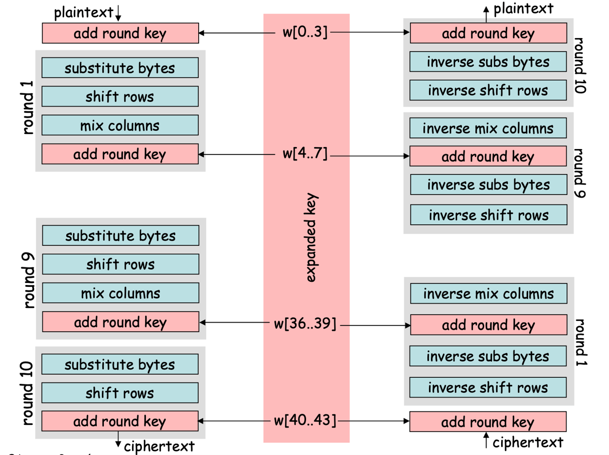

AES 的分组长度为 128 位，即 16 个字节。在加密过程中，AES 将输入的 16 个字节组织成一个 4x4 的状态矩阵，每个字节对应矩阵中的一个元素。初始矩阵按照如下方式排列：

$$
\begin{bmatrix}
Byte_0 & Byte_4 & Byte_8 & Byte_{12} \\
Byte_1 & Byte_5 & Byte_9 & Byte_{13} \\
Byte_2 & Byte_6 & Byte_{10} & Byte_{14} \\
Byte_3 & Byte_7 & Byte_{11} & Byte_{15}
\end{bmatrix}
$$

AES 每一轮迭代的结构都相同，由 4 个不同的变换组成，分别是：

1. **字节代换 (SubBytes)**：使用 S-Box 对每个字节进行非线性代换。
2. **行移位 (ShiftRows)**：对状态矩阵的每一行进行循环左移，移位的数量取决于行的索引。
3. **列混合 (MixColumns)**：对状态矩阵的每一列进行线性变换，提供扩散效果。
4. **轮密钥加 (AddRoundKey)**：将当前轮的子密钥与状态矩阵进行按位异或操作，将轮密钥混合到中间数据

除了最后一轮，省略了列混合 (MixColumns) 变换。

解密过程与加密过程类似，只是顺序不同。

以下将详细讲述每个变换的具体实现以及轮密钥的生成方法。

### 字节代换 (SubBytes)

字节代换是 AES 中的非线性变换，它使用一个固定的 16x16 的 S-Box 对每个字节进行代换。矩阵表中纵向的索引表示字节的高 4 位，横向的索引表示字节的低 4 位。每个字节在 S-Box 中查找对应的代换值。

### 行移位 (ShiftRows)

行移位是 AES 中的线性变换，它对状态矩阵的每一行进行循环左移。具体来说：
- 第 0 行不进行移位。
- 第 1 行循环左移 1 个字节。
- 第 2 行循环左移 2 个字节。
- 第 3 行循环左移 3 个字节。

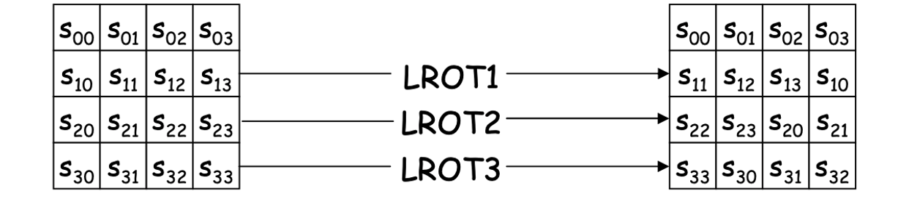

### 列混合 (MixColumns)

列混合是 AES 中的线性变换，它对状态矩阵的每一列进行多项式乘法运算。每一列被视为 $GF(2^8)$ 上的一个多项式，并与固定的多项式进行模 $x^4 + 1$ 的乘法运算。这个变换提供了扩散效果，使得每个输入字节影响输出的多个字节。

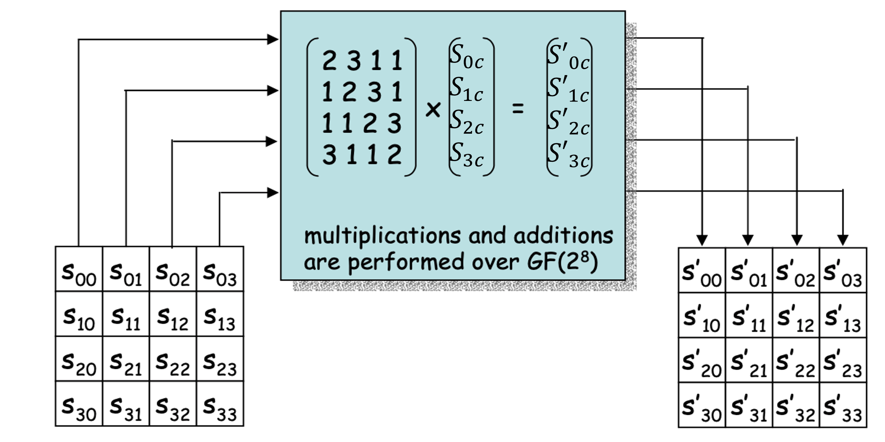

### 轮密钥加 (AddRoundKey)

轮密钥加是 AES 中的线性变换，它将当前轮的子密钥与状态矩阵进行按位异或操作。每一轮的子密钥是通过密钥扩展算法从主密钥派生出来的，每轮要用 4 个导出的 32 比特子密钥。

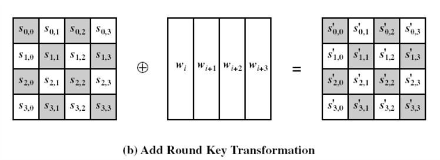

### 轮密钥生成

假设 AES 一公钥加密 $N_r$ 轮，每轮使用 $N_b$ 比特的子密钥，考虑到第一轮轮密钥相加也需要使用子密钥，因此全程需要用 $N_b \times (N_r + 1)$ 比特的子密钥。AES 的密钥扩展算法将主密钥扩展为所需的子密钥序列。 

对于最初的几个子密钥，直接从主密钥中提取。对于后续的子密钥，使用以下方法生成：

1. 将前一轮的 16 字节子密钥分成 4 个 4 字节的子密钥；
2. 将最后一个子密钥循环左移 1 个字节；
3. 使用 S-Box 对循环左移后的子密钥进行字节代换；
4. 将代换后的子密钥与轮常量进行异或操作，得到新的子密钥；
5. 将新的子密钥与前一轮的第一个子密钥进行异或操作，得到新的子密钥；
6. 重复步骤 5，直到生成这一轮所需要的所有子密钥。

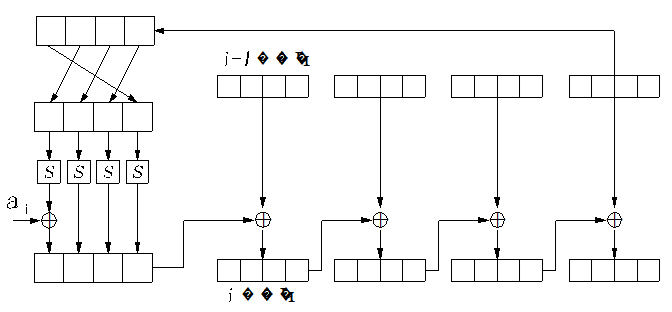

## 分组密码的工作模式

前面讲的所有分组密码算法都是针对固定长度的分组进行加密的，但在实际应用中，明文的长度通常不是固定的，因此需要使用分组密码的工作模式来处理不同长度的明文。常见的分组密码工作模式包括：

- 块模式（Block Modes）：如电子密码本模式 (ECB)、密码分组链接模式 (CBC) 等。
- 流模式（Stream Modes）：如输出反馈模式 (OFB)、密码反馈模式 (CFB)、计数器模式 (CTR) 等。

### ECB (Electronic Codebook) 模式

ECB 模式是最简单的分组密码工作模式，它将明文分成固定长度的块，每个块独立加密。以 DES 为例，加密公式即为

$$ C_i = DES_{K}(P_i) $$

这种方法适合短数据加密（比如密钥传输），但是相同明文块会生成相同的密文块，安全性较差。密文块的一个比特错误只会影响对应的一个明文块，所以 ECB 模式不适合加密超过一个分组的明文数据。如果加密的消息具有比较规则的格式的话，攻击者可以通过分析密文块的模式来推测明文的内容。

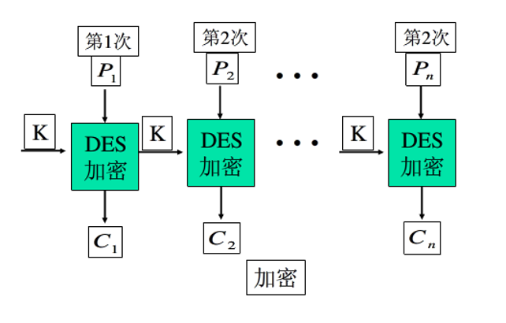

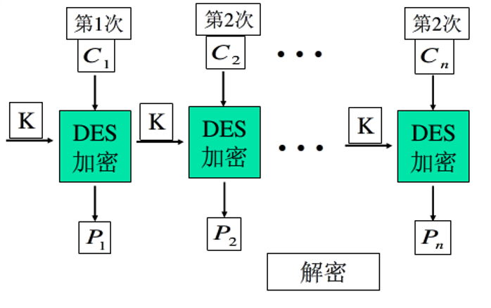

### CBC (Cipher Block Chaining) 模式

CBC 模式在加密时将每个明文块与前一个密文块进行异或操作，然后再进行加密。第一个明文块与一个初始化向量 (IV) 进行异或操作。加密公式如下：

$$
\begin{aligned}
C_0 &= IV \\
C_i &= DES_{K}(P_i \oplus C_{i-1}) \quad \text{for } i = 0, 1, 2, \ldots
\end{aligned}
$$

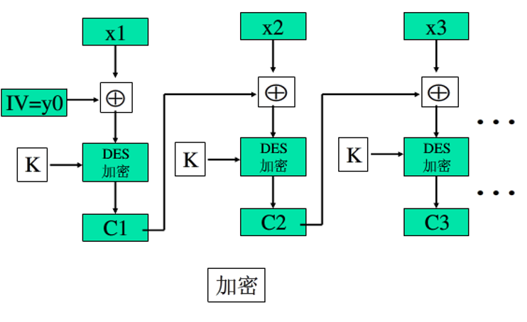

解密时，每个密文分组被解密后，再与前一个密文分组进行异或操作，得到明文分组：

$$
C_j = E_K(P_j \oplus C_{j-1}) \implies P_j = D_K(C_j) \oplus C_{j-1}
$$

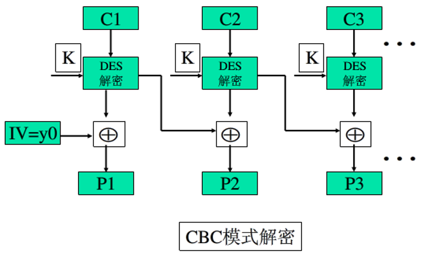

对于 CBC 模式，最重要的是保护 IV 的安全性。如果敌手能够欺骗双方使用不同的 IV 值，那么敌手就可以在明文的第 1 个分组中插入自己选择的比特值，通过篡改发送给接收方的 IV 值，控制接收者的解密结果。如果敌手篡改 IV 中的第 $i$ 个比特，那么接收者解密后的明文的第 $i$ 个比特就会被翻转。为了防止这种攻击，IV 对于收发双方都应该是已知的，并且每次加密时都应该使用不同的 IV 值。

CBC 模式除了可以用于保密以外，还可以用于认证。通过在最后一个分组加密后，取密文的最后一个分组作为消息认证码 (MAC)，可以验证消息的完整性和真实性。

错误传播方面，如果密文快 $C_j$ 出现了一个比特错误，那么解密后的明文块 $P_j$ 会完全变成乱码，而 $P_{j+1}$ 会在 $C_j$ 中对应该比特错误的位置上出现一个比特错误，其他位置不受影响。之后的明文块不会受到影响。

### CFB (Cipher Feedback) 模式

CFB 模式是一种流密码模式，它将分组密码转换为流密码。CFB 模式将前一个密文块加密后，与当前明文块进行异或操作，得到当前密文块。加密过程中通常取 $j = 8$，即每次处理一个字节。每一个密文快 $C_m$ 都依赖于明文块 $P_m$ 以及之前的所有明文块 $P_0, P_1, \ldots, P_{m-1}$。

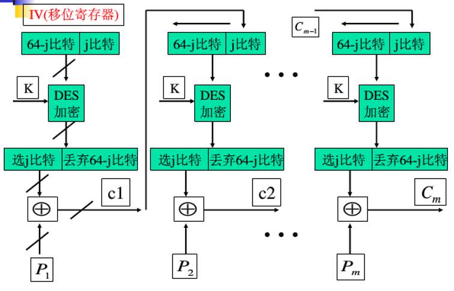

解密过程与加密类似，使用前一个密文块加密后，与当前密文块进行异或操作，得到当前明文块：

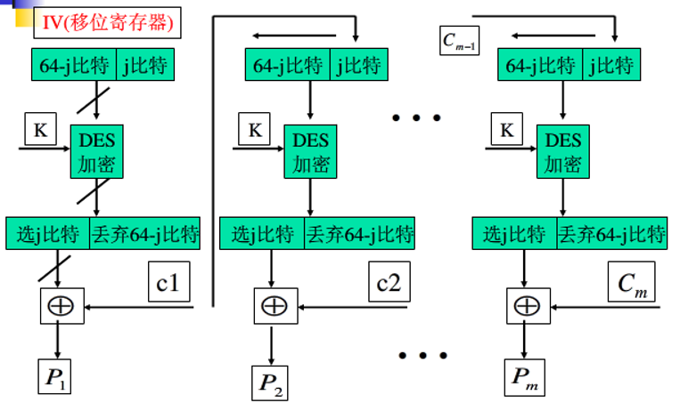

CFB 适合数据以比特或者字节作为单位出现的场景。在相同的密钥但是不同 IV 下加密相同明文，会生成不同的密文。IV 可以直接发送，但是需要保证其完整性，不得被篡改，否则会导致解密后的明文出现错误。

由于 $C_m$ 依赖之前的所有明文块，因而重新排列密文块会影响解密。正确解密一个密文块需要前面的 $n/j$ 个密文块的正确解密结果（对于 DES，$n = 64），而 $C_m$ 中的一个比特错误会影响 $P_m$ 对应比特以及后续 $n/j$ 个明文块的解密结果。

### OFB (Output Feedback) 模式

OFB 模式也是一种流密码模式，它将分组密码转换为流密码。OFB 模式使用前一个输出块加密后，与当前明文块进行异或操作，得到当前密文块。OFB是将加密算法的输出反馈到移位寄存器，而CFB是将密文单元反馈到移位寄存器。OFB模式的加密过程如下：

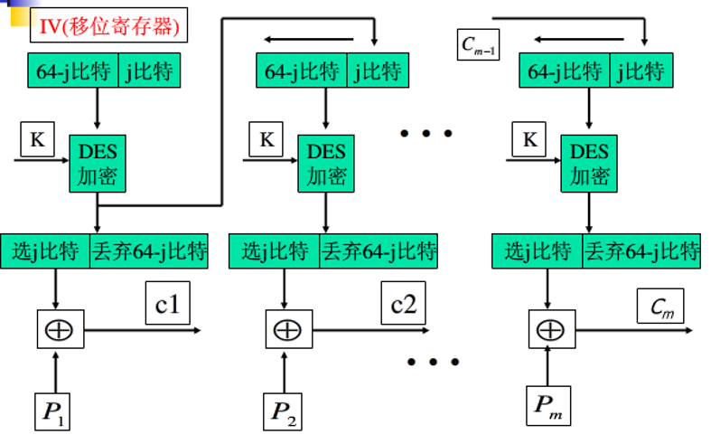

解密过程与加密类似，使用前一个输出块加密后，与当前密文块进行异或操作，得到当前明文块：

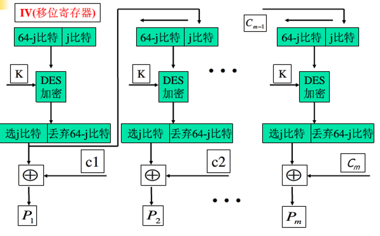

对于 OFB 的 IV，每条新消息应该使用相同的 IV，否则消息将会使用相同的密钥流进行加密，导致相同的明文块生成相同的密文块，从而降低安全性。由于密文块 $C_m$ 仅依赖于明文块 $P_m$，比特错误不会传播到下一个块，但是重新排列密文块会影响解密。

OFB 可以提前计算密钥流，因此可以在接收方还没有收到密文时就开始解密。OFB 模式适合数据以比特或者字节作为单位出现的场景。

### CTR (Counter) 模式

CTR 模式也是一种流密码模式，它将分组密码转换为流密码。CTR 模式使用一个计数器作为输入，每次加密计数器的值，然后与当前明文块进行异或操作，得到当前密文块。CTR 模式的加、解密过程如下：

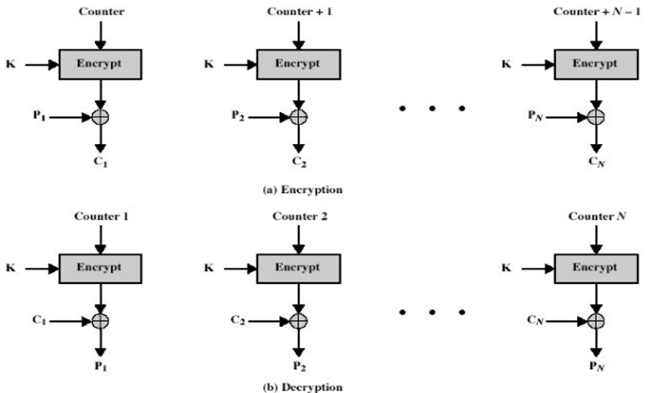

CTR 模式的优点在于，它可以并行处理多个分组，并且可以预先计算密钥流，从而提高加密和解密的效率。密钥周期的长度取决于计数器的长度，通常为 64 位或 128 位。为了保证安全性，计数器的值必须是唯一的，不能重复使用，否则会导致密文块的重复，从而降低安全性。

## 密码分析攻击

攻击者可以通过分析加密算法的结构和特性，尝试从密文中恢复明文或密钥。密码分析攻击可以分成如下几类：

1. **唯密文攻击 (Ciphertext-only attack)**：攻击者仅能获取密文，尝试通过分析密文的统计特性来推测明文或密钥。
2. **已知明文攻击 (Known-plaintext attack)**：攻击者可以获取一些明文及其对应的密文，尝试通过分析这些明文-密文对来推测密钥。
3. **选择明文攻击 (Chosen-plaintext attack)**：攻击者可以选择一些明文，并获取其对应的密文，尝试通过分析这些明文-密文对来推测密钥。
4. **自适应选择明文攻击 (Adaptive chosen-plaintext attack)**：攻击者可以选择明文，并根据之前的加密结果来选择新的明文，尝试通过分析这些明文-密文对来推测密钥。
5. **选择密文攻击 (Chosen-ciphertext attack)**：攻击者可以选择一些密文，并获取其对应的明文，尝试通过分析这些密文-明文对来推测密钥。
6. **自适应选择密文攻击 (Adaptive chosen-ciphertext attack)**：攻击者可以选择密文，并根据之前的解密结果来选择新的密文，尝试通过分析这些密文-明文对来推测密钥。

实际应用中比较常见的分析方法是差分密码分析。攻击者构造若干个明文对，每一对明文的差分值相同，观察对应的密文差分值，随后通过分析特定明文对的差分到密文对的差分的传播的非随机性，恢复密钥。

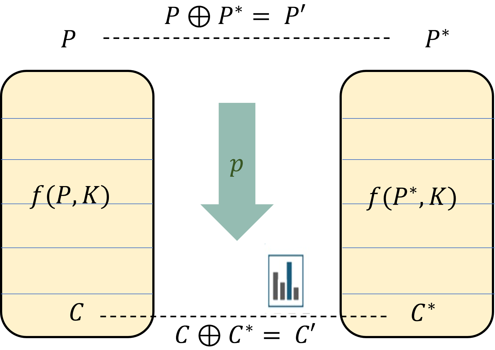