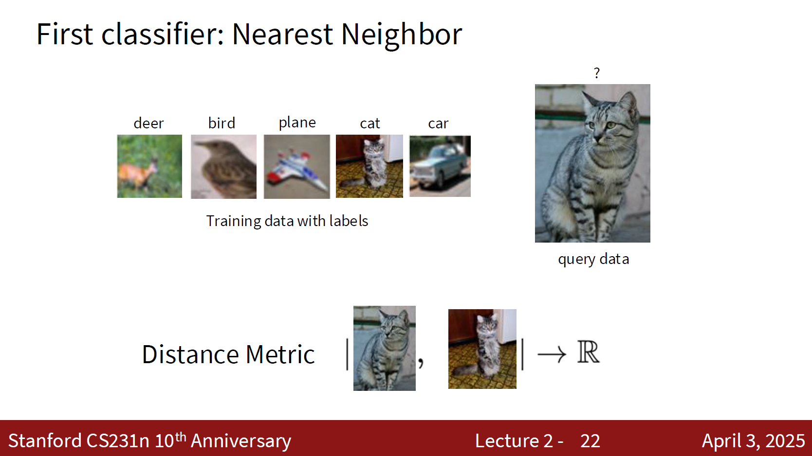
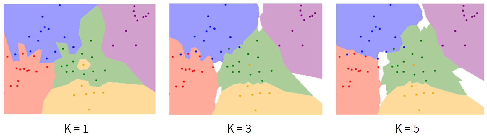
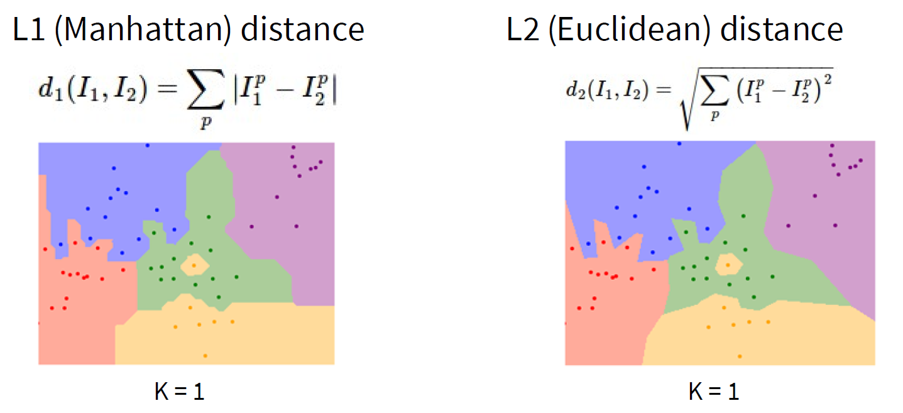
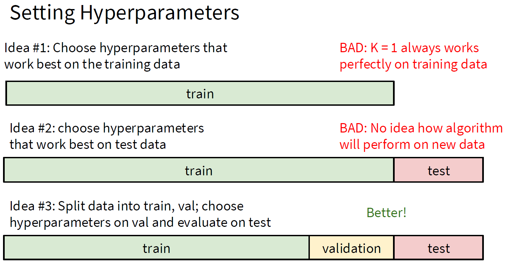
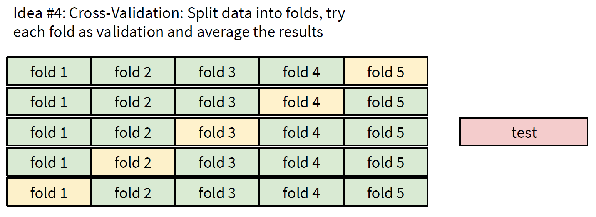

> [!Caution] 声明
> - 笔记内容基于斯坦福大学的CS231n课程（[Stanford CS231n: Deep Learning for Computer Vision](http://cs231n.stanford.edu/)），主要内容是关于计算机视觉和深度学习的相关知识。
> - 文中使用的代码示例和图像均来自课程资料，版权归原作者所有。
> - 本笔记旨在帮助学习者更好地理解课程内容，任何转载或引用请注明出处，不涉及商业用途。如有任何版权问题，请联系我进行处理。

前一份笔记中，我们简要讲述了计算机视觉和深度学习的当代历史。本质上，计算机视觉就是让计算机做一件事情：看图识物。我们希望计算机能够通过分析图像来识别其中的内容，比如识别出图像中的人、动物、物体等。这就是计算机视觉的核心任务之一。 

> [!Important] 图像分类的数学模型
> 假设每一张图片的长度为 $H$，宽度为 $W$，通道数为 $C$（比如RGB图像的通道数为3），那么一张图片可以表示为一个三维张量 $X \in \mathbb{R}^{H \times W \times C}$。
> 
> 假设我们有 $K$ 个类别需要分类，那么分类的目标就是将图片 $X$ 映射到一个类别标签 $y$，其中 $y$ 属于集合 $\{1, 2, \ldots, K\}$。换句话说，我们需要找到一个函数 $f$，使得对于任意一张图片 $X$，都能预测出它的标签 $y$：
> 
> $$ y = f(X) $$

那么，怎么找到这个函数 $f$ 呢？你可能会想：

> [!Tip] 手搓规则？
> 嗯，我们可不可以通过手写一些规则来实现这个映射？比如说，如果图片中有一个圆形的物体，我们就把它归类为“球”，如果有四条腿的动物，我们就把它归类为“狗”或者“猫”。

但是，现实情况远比这复杂得多。图象分类的难点（或者说，计算机视觉的难点）在于，图像中的物体可能会有各种各样的变化，比如：

- **视角变化（Viewpoint Variation）**：同一个物体从不同的角度拍摄，可能看起来完全不同。
- **光照变化（Illumination Variation）**：不同的光照条件下，物体的颜色和亮度会发生变化。
- **背景杂斑（Background Clutter）**：物体可能出现在各种复杂的背景中，增加了识别的难度。
- **遮挡（Occlusion）**：物体可能被部分遮挡，导致无法完整地看到它。
- **形变（Deformation）**：同一个类别的物体可能有不同的形状和大小，比如不同品种的狗。
- **噪声（Noise）**：图像可能包含各种噪声，影响识别效果。
- **类别多样性（Intra-class Variability）**：现实世界中存在成千上万种不同的物体类别，手写规则难以覆盖所有情况。
- **语境依赖（Contextual Dependency）**：物体的识别可能依赖于其所在的环境和上下文信息，单纯的规则难以捕捉这些复杂的关系。

这下难办了，手写规则显然无法应对这些复杂的变化。那么，我们该怎么办呢？只能交给机器学习来解决这个问题了。

> [!Important] 机器学习的定义
> **机器学习**是指设定好一个带有大量参数的模型（你可以理解为函数），然后通过大量的标注数据来训练这个模型，让它自动学习到图片和标签之间的复杂关系。通过这种方式，模型可以逐渐掌握如何从图像中提取有用的特征，并根据这些特征来进行分类。

这就是机器学习的任务，总结下来就是三句话：

1. **收集数据**：我们需要大量的标注数据集，包含图片和对应的标签。
2. **模型训练**：我们需要选择一个合适的模型，并使用收集到的数据来训练这个模型，使其能够学习到图片和标签之间的关系。
3. **模型评估**：我们需要评估训练好的模型在未见过的数据上的表现，确保它能够泛化到新的图片上。

如果我们用程序代码来表示这个过程，可以写成这样：

```python
def train(images, labels):
    # 模型训练
    return model

def predict(model, image):
    # 使用训练好的模型进行预测
    return predicted_label
```

在接下来的内容中，我们将从最简单的最近邻分类器（Nearest Neighbor Classifier）开始，逐步引入更复杂的线性分类器（Linear Classifier）和非线性分类器，并最终过渡到深度学习模型。通过这些步骤，我们将逐渐理解计算机视觉中的分类任务是如何实现的，以及深度学习在其中扮演的角色。

### 最近邻分类器（Nearest Neighbor Classifier）

最简单的机器学习模型就是最近邻分类器。它的基本思想是：对于一张新的图片，我们找到训练集中与它最相似的图片，然后将这张图片的标签作为新图片的预测标签。

> [!Important] 最近邻分类器的数学模型
> 给定数据集 $\{(X_1, y_1), (X_2, y_2), \ldots, (X_N, y_N)\}$，其中 $X_i$ 是第 $i$ 张图片，$y_i$ 是对应的标签。
>
> 对于新的图片 $X$，我们计算它与训练集中每张图片的距离，然后找到距离最近的图片 $X_j$，并将其标签 $y_j$ 作为预测标签：
> $$ \hat{y} = y_j \quad \text{where} \quad j = \arg\min_{i} \text{dist}(X, X_i) $$
>
> 这里，$\text{dist}(X, X_i)$ 是衡量两张图片相似度的距离函数，他的定义域和值域分别是 $\mathbb{R}^{H \times W \times C} \times \mathbb{R}^{H \times W \times C}$ 和 $\mathbb{R}$。



一个新的问题：这个距离函数该怎么定义呢？一般常见的有两种：曼哈顿距离（Manhattan Distance）和欧几里得距离（Euclidean Distance）。我们在最近邻分类器中一般用的是曼哈顿距离。

> [!Important] 曼哈顿距离和欧几里得距离
> 给定两张图片 $X$ 和 $Y$，它们的曼哈顿距离和欧几里得距离分别定义如下：
> - **曼哈顿距离**：
>   $$ \text{dist}_{\text{Manhattan}}(X, Y) = \sum_{h, w, c} |X_{h,w,c} - Y_{h,w,c}| $$
> - **欧几里得距离**：
>   $$ \text{dist}_{\text{Euclidean}}(X, Y) = \sqrt{\sum_{h, w, c} (X_{h,w,c} - Y_{h,w,c})^2} $$
>
> 

这就是最近邻分类器的基本原理。它的算法复杂度怎么样呢？它在训练阶段的复杂度是 $O(1)$，因为它不需要进行任何训练；而在预测阶段的复杂度是 $O(N)$，因为它需要计算新图片与所有训练图片的距离。欸，这个复杂度有点高啊……毕竟我们更希望模型的预测阶段复杂度更低一些，因为你有更多的时间来训练模型，但是预测阶段需要更快地给出结果，否则模型的用户就要等很久。想象一下，你用手机拍了一张照片，想要识别里面的物体，如果模型需要花费几分钟甚至更长时间来给出结果，那你的第一反应肯定就是把这个软件卸载了，然后挂到社交媒体上吐槽它。

尽管如此，最近邻分类器依然是一个很好的起点。它简单易懂，容易实现，并且在某些情况下表现还不错。如果你的数据量比较少的话，最近邻分类器甚至可以达到不错的效果。比如下面这个，是我们用曼哈顿距离分类得到的：


但是这个图片里面有一个不太和谐的点，就是中间那一块绿色区域中间冒出来那个黄色的东西。这个黄色的东西是什么呢？它是一个错误分类的例子。我们可以看到，在这个绿色区域中，最近邻分类器错误地将一些图片分类为黄色类别了。这就是最近邻分类器的一个缺点：它对噪声和异常值非常敏感，因为它只考虑了最近的一个邻居，而没有考虑其他邻居的信息。

既然如此，那我们不妨引入一个改进版本的最近邻分类器，叫做K近邻分类器（K-Nearest Neighbors Classifier）。它的基本思想是：对于一张新的图片，我们找到训练集中与它最相似的K张图片，然后根据这K张图片的标签来进行投票，最终将得票最多的标签作为新图片的预测标签。

> [!Important] K近邻分类器的数学模型
> 给定数据集 $\{(X_1, y_1), (X_2, y_2), \ldots, (X_N, y_N)\}$，其中 $X_i$ 是第 $i$ 张图片，$y_i$ 是对应的标签。
> 
> 对于新的图片 $X$，我们计算它与训练集中每张图片的距离，然后找到距离最近的K张图片 $X_{j_1}, X_{j_2}, \ldots, X_{j_K}$，并根据这K张图片的标签进行投票：
> 
> $$ \hat{y} = \arg \max_{c \in \mathcal{C}} \sum_{i \in \mathcal{N}_K(X)} \mathbb{I}(y_i = c) $$
>
> 其中，$\mathcal{N}_K(X)$ 是距离图片 $X$ 最近的K张图片的索引集合，$\mathbb{I}$ 是指示函数，$\mathcal{C}$ 是所有可能的类别集合。


> [!Note] 距离函数的选择
> 具体要选择哪种距离函数，还需要根据具体的数据集和任务来决定。一般来说，欧几里得距离在高维空间中表现更好一些，如果我们进行旋转、翻折等操作，欧几里得距离形成的圆形或者球形（更高维的空间中，形成的轨迹投影到二维平面的话也是一个圆）表现会更稳定一些，更能衡量图片之间的相似度。
> 
> 而曼哈顿距离在某些特定情况下也有其优势，比如当数据具有稀疏性时，或者你需要保持向量的语义一致性时。这种情况下，你就必须要选择会因坐标系改变而改变的距离函数。

一般在K近邻分类器中，K的取值一般是奇数，以避免投票出现平局的情况。尽管如此，但是还是容易出现投票平局的情况，尤其是在类别数较多的情况下。为了解决这个问题，我们可以引入加权投票的机制，即根据距离的远近来给每个邻居分配不同的权重，距离越近的邻居权重越大，距离越远的邻居权重越小。这样一来，即使出现平局的情况，也能通过权重来决定最终的预测标签。

> [!Important] 加权K近邻分类器的数学模型
> 给定数据集 $\{(X_1, y_1), (X_2, y_2), \ldots, (X_N, y_N)\}$，其中 $X_i$ 是第 $i$ 张图片，$y_i$ 是对应的标签。
> 对于新的图片 $X$，我们计算它与训练集中每张图片的距离，然后找到距离最近的K张图片 $X_{j_1}, X_{j_2}, \ldots, X_{j_K}$，并根据这K张图片的标签进行加权投票：
> $$ \hat{y} = \arg \max_{c \in \mathcal{C}} \sum_{i \in \mathcal{N}_K(X)} w_i \cdot \mathbb{I}(y_i = c) $$
> 其中，$w_i = \frac{1}{\text{dist}(X, X_i) + \epsilon}$ 是第 $i$ 个邻居的权重，$\epsilon$ 是一个很小的常数，用于防止除以零。

好了，讲了这么多K近邻分类器，我们来看看它的效果怎么样吧。下面这个图片展示了K近邻分类器在不同K值和不同距离函数下的分类结果：





可以看到，随着K值的增加，分类结果变得更加平滑，错误分类的情况也减少了。这是因为K近邻分类器考虑了更多的邻居信息，能够更好地抵抗噪声和异常值的影响。而不同的距离函数也会对分类结果产生影响，欧几里得距离在这个例子中表现得更好一些，边界也更加平滑。

但是，这样一来，又有新的问题了：

> [!Tip] K和距离函数怎么选择？
> 不同的K值和距离函数会对分类结果产生很大的影响。那么，我们该如何选择合适的K值和距离函数呢？

像K值和距离函数这种提前设定的参数，我们称之为**超参数（Hyperparameter）**。选择合适的超参数是机器学习中的一个重要问题。一般来说，我们可以通过交叉验证（Cross-Validation）来选择最优的超参数。具体来说，我们可以将数据集划分为训练集（Training Set）、验证集（Validation Set）和测试集（Test Set）。我们使用训练集来训练模型，然后在验证集上评估不同超参数的表现，选择表现最好的超参数，最后在测试集上评估最终模型的性能。



还有一种更加合适的方法，叫做**交叉验证（Cross-Validation）**。它的基本思想是：将数据集划分为K个子集，然后进行K次训练和验证。每次选择一个子集作为验证集，剩下的子集作为训练集。这样一来，我们就可以充分利用数据集中的所有数据，同时也能更好地评估模型的性能。



不过对于K近邻分类器来说，交叉验证的作用并不是特别大，因为它本身没有训练阶段，超参数的选择主要影响的是预测阶段的性能。但是对于其他有训练阶段的机器学习模型来说，交叉验证是一个非常重要的技术手段。

实际上，K近邻分类器虽然简单易懂，但在实际应用中并不常用。它的预测阶段复杂度较高，尤其是当数据集较大时，计算距离的时间会变得非常长。此外，它对高维数据表现不佳，容易受到“维度灾难”的影响。对于图像分类，这种基于像素的距离计算方法往往效果不佳，因为它没有考虑到图像中的结构和语义信息。


上图中，有遮掩（occlusion）、偏移、调色后的图片与原图的像素距离完全一致，但它们的语义距离却完全不同。这就是K近邻分类器在图像分类任务中面临的一个重要问题：它只考虑了像素级别的距离，而没有考虑到图像中的结构和语义信息。因此，虽然K近邻分类器是一个很好的起点，但我们需要更复杂的模型来解决图像分类问题，这就是我们接下来要介绍的线性分类器（Linear Classifier）。

好的，讲了这么多K近邻分类器，我们来总结一下它的优缺点吧：

- **优点**：
  - 简单易懂，容易实现。
  - 不需要训练阶段，适合小数据集。
  - 能够处理多类别分类问题。
  - 对异常值和噪声有一定的抵抗能力（尤其是K值较大时）。
- **缺点**：
  - 预测阶段复杂度较高，尤其是数据集较大时。
  - 对高维数据表现不佳，容易受到“维度灾难”的影响。
  - 需要选择合适的K值和距离函数，超参数选择较为复杂。
  - 对类别不平衡的数据集表现较差。

总的来说，K近邻分类器虽然有一些优点，但在实际应用中并不常用。它更适合作为一个教学工具，帮助我们理解机器学习的基本概念和原理。对于图像分类任务，我们需要更复杂的模型来解决这个问题，这就是我们接下来要介绍的线性分类器（Linear Classifier）。

欲知后事如何，请听下回分解……