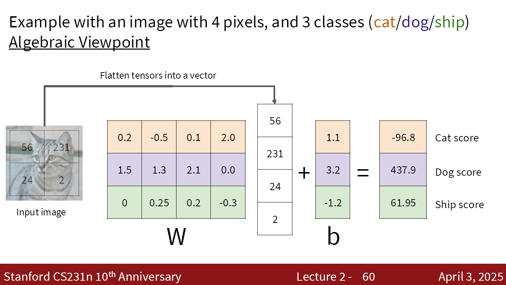
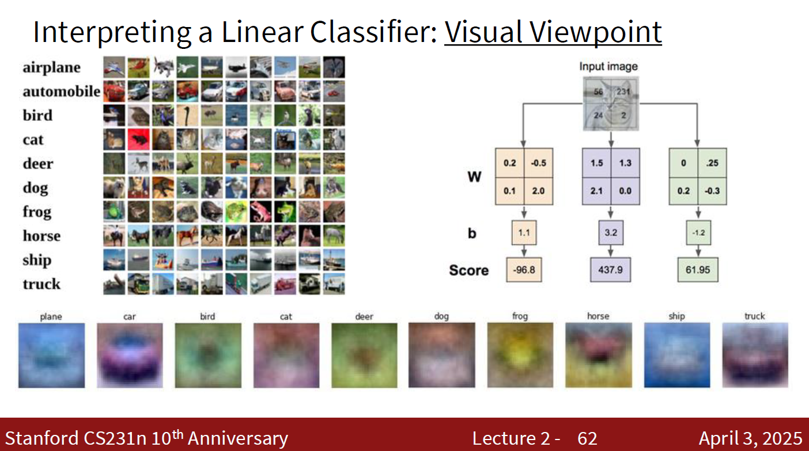

> [!Caution] 声明
> 笔记内容基于斯坦福大学的CS231n课程（[Stanford CS231n: Deep Learning for Computer Vision](http://cs231n.stanford.edu/)），主要内容是关于计算机视觉和深度学习的相关知识。
> 文中使用的代码示例和图像均来自课程资料，版权归原作者所有。
> 本笔记旨在帮助学习者更好地理解课程内容，任何转载或引用请注明出处，不涉及商业用途。如有任何版权问题，请联系我进行处理。

书接上回，我们讲到最近邻分类器（Nearest Neighbor Classifier）。虽然它非常简单，但在某些情况下也能取得不错的效果。然而，最近邻分类器有一个明显的缺点：它需要在每次预测时都计算与训练集中所有图片的距离，这在训练集很大时会非常慢。因此，我们需要一种更高效的分类方法，这就是线性分类器（Linear Classifier）。它的基本思想是：我们通过学习一个线性函数来直接将图片映射到类别标签，而不需要在每次预测时都进行大量的距离计算。

> [!Important] 线性分类器的数学模型
> 给定一张图片 $X \in \mathbb{R}^{H \times W \times C}$，我们首先将其展平为一个向量 $x \in \mathbb{R}^D$，其中 $D = H \times W \times C$。然后，我们定义一个线性函数 $f$，它由一个权重矩阵 $W \in \mathbb{R}^{K \times D}$ 和一个偏置向量 $b \in \mathbb{R}^K$ 组成：
> $$ f(x) = Wx + b $$
> 其中，$f(x)$ 的输出是一个长度为 $K$ 的向量，表示每个类别的得分。我们可以通过选择得分最高的类别来进行预测：
> $$ \hat{y} = \arg\max_{k} f_k(x) $$

我们来分析一下这个模型。首先，权重矩阵 $W$ 的每一行对应一个类别，每一列对应输入向量 $x$ 的一个特征。偏置向量 $b$ 则为每个类别提供了一个额外的调整项。通过学习 $W$ 和 $b$，我们可以让模型学会如何根据输入图片的特征来区分不同的类别。

至于复杂度，线性分类器的预测过程只需要进行一次矩阵乘法和一次加法，因此它的时间复杂度是 $O(KD)$，其中 $K$ 是类别数，$D$ 是输入特征的维度。这比最近邻分类器的 $O(ND)$（其中 $N$ 是训练集大小）要高效得多，尤其当训练集很大时。

> [!Warning] 线性分类器的参数
> 严格意义上，线性分类器有两组参数：权重矩阵 $W$ 和偏置向量 $b$。不过在后续内容中，为了方便起见，我们通常会将偏置项 $b$ 吸收进权重矩阵 $W$ 中，通过在输入向量 $x$ 的末尾添加一个常数特征（通常是1）来实现。这种做法可以简化模型的表示，使得我们只需要关注一个参数矩阵 $W$。也就是说，我们可以把线性分类器的数学模型简化成：
> $$ f(x) = Wx $$

讲到这里，不知道大家会不会有个小问题：

> [!Tip] 权重矩阵有什么含义？
>
> 我们将权重矩阵和图片向量相乘，得到每个类别的得分。那么，这些权重矩阵中的值到底代表了什么呢？它们是如何影响分类结果的呢？

这是一个很好的问题，我们有三种理解它的方法：代数角度（Algebraic Viewpoint）、视觉角度（Visual Viewpoint）和几何角度（Geometric Viewpoint）。我们将逐一介绍这三种理解方法，帮助大家更深入地理解线性分类器的工作原理。

### 从代数角度理解线性分类器

从代数角度来说，线性分类器的权重矩阵 $W$ 可以看作是一个变换矩阵，它将输入向量 $x$ 映射到一个新的空间中。在这个新的空间中，每个类别对应一个维度，权重矩阵中的每一行可以看作是一个类别的特征权重。当我们将输入向量 $x$ 与权重矩阵 $W$ 相乘时，我们实际上是在计算输入向量在每个类别特征上的加权和，这些加权和就是每个类别的得分。

### 从视觉角度理解线性分类器

上一张图片中，我们可以将图片向量和权重矩阵的每一行看作是一个图像。当我们将输入图片与权重矩阵相乘时，我们实际上是在计算输入图片与每个类别的权重图像之间的相似度。得分越高，说明输入图片与该类别的权重图像越相似，因此更有可能被分类为该类别。

也就是说，权重矩阵的每一行可以看作是一个类别的“模板”，当输入图片与这个模板越相似时，得分就越高，分类结果就越倾向于这个类别。

### 从几何角度理解线性分类器

从几何角度来说，线性分类器可以看作是在输入空间中划分不同类别的超平面。每个类别对应一个超平面，当输入向量落在某个类别的超平面的一侧时，就被分类为该类别。权重矩阵中的每一行定义了一个超平面的法向量，这些超平面将输入空间划分成不同的区域，每个区域对应一个类别。当输入向量落在某个类别的区域内时，线性分类器就会将其分类为该类别。

欸，看到这张图片，不知道你有没有发现一个问题：线性分类器，顾名思义，是一个线性的模型，那么它只能划分出线性可分的类别吗？**如果两个类别在输入空间中是线性不可分的，那么线性分类器就无法正确地将它们区分开来。** 这就是线性分类器的一个重要限制。比如说，下面图中的这些情况，就是没办法使用线性分类器进行分类的：

### 什么是一个好的线性分类器

我们已经介绍了线性分类器的基本原理，并且从代数、视觉、几何三个角度理解它的工作机制。接下来一个重要的问题是：什么样的线性分类器才是一个好的线性分类器呢？我们需要的线性分类器可以尽可能地将不同类别的图片区分开来，并且在未见过的数据上也能有良好的表现。

为此，我们需要一种衡量线性分类器好坏的标准，这就是**损失函数**（Loss Function）。损失函数是一个用来评估模型（不仅仅是线性分类模型）预测结果与真实标签之间差距的函数。我们希望通过最小化损失函数来优化模型的参数，使得模型能够更准确地进行分类。

> [!Important] 损失函数的定义
> 给定一个数据集 $\{(x_1, y_1), (x_2, y_2), \ldots, (x_N, y_N)\}$，其中 $x_i$ 是第 $i$ 张图片，$y_i$ 是对应的标签。对于一个线性分类器，我们可以定义一个损失函数 $L(W)$ 来衡量模型的性能：
> $$ L(W) = \frac{1}{N} \sum_{i=1}^{N} L_i (f(x_i; W), y_i) $$
> 其中，$L_i (f(x_i; W), y_i)$ 是单个样本的损失函数，用来衡量模型对第 $i$ 张图片的预测结果 $f(x_i)$ 与真实标签 $y_i$ 之间的差距。我们希望通过调整权重矩阵 $W$ 来最小化这个损失函数，从而得到一个好的线性分类器。

新的问题出现了：怎么定义单个样本的损失函数呢？我们前面的线性分类器最后的输出是一个得分向量，每一类标签的得分范围是不确定的，我们只有比较他们的相对大小才能知道哪个类别的得分更高，所以我们需要一个损失函数来衡量模型的预测结果与真实标签之间的差距。这时候，我们前面这种标签得分的方法就不太适合了。

一个比较自然的想法是：我们可不可以把得分高低转换成概率的形式呢？也就是说，我们希望模型的输出不仅仅是一个得分向量，而是一个概率分布，表示每个类别的预测概率。这就引入了一个很重要的概念：**Softmax函数**。Softmax函数可以将一个实数向量转换成一个概率分布，使得每个类别的预测概率都在0和1之间，并且所有类别的预测概率加起来等于1。

> [!Important] Softmax函数的定义
> 给定一个实数向量 $z \in \mathbb{R}^K$，Softmax函数定义如下：
> $$ \text{Softmax}(z)_k = \frac{e^{z_k}}{\sum_{j=1}^{K} e^{z_j}} $$
> 其中，$z_k$ 是向量 $z$ 中第 $k$ 个元素，$\text{Softmax}(z)_k$ 是Softmax函数对第 $k$ 个类别的预测概率。通过使用Softmax函数，我们可以将线性分类器的输出得分转换成一个概率分布，从而更好地衡量模型的预测结果与真实标签之间的差距。

好了，接下来一个比较自然的想法就是比较Softmax函数得到的预测概率和真实概率向量之间的差距了。

> [!Note] 真实概率向量的定义
> 在分类问题中，真实标签通常是一个离散的类别标签，我们可以将其转换成一个one-hot编码（one-hot encoding）的形式来表示真实概率。具体来说，如果有 $K$ 个类别，那么对于第 $i$ 张图片的真实标签 $y_i$，我们可以定义一个长度为 $K$ 的向量 $y_i^{\text{one-hot}}$，其中只有第 $y_i$ 个位置是1，其余位置都是0。这样，我们就可以将真实标签转换成一个概率分布的形式，与模型的预测概率进行比较。

我们可以使用**交叉熵损失函数**（Cross-Entropy Loss）来衡量这个差距。

> [!Important] 交叉熵损失函数的定义
> 给定一个数据集 $\{(x_1, y_1), (x_2, y_2), \ldots, (x_N, y_N)\}$，其中 $x_i$ 是第 $i$ 张图片，$y_i$ 是对应的标签。对于一个线性分类器，我们可以定义交叉熵损失函数 $L(W)$ 来衡量模型的性能：
> $$ L(W) = -\frac{1}{N} \sum_{i=1}^{N} L_i (W) $$
> $$ \begin{aligned} L_i (W) &= -\log P(Y = y_i | X = x_i; W) \\ &= -\log \left(\frac{e^{s_{y_i}}}{\sum_{j=1}^{K} e^{s_j}}\right) \end{aligned} $$

由此，我们就可以使用交叉熵损失函数来衡量不同的权重矩阵 $W$ 和偏置向量 $b$ 的好坏了。我们希望通过最小化这个损失函数来找到一个好的线性分类器，使得模型能够更准确地进行分类。

那么怎么找到一组好的权重矩阵和偏置向量呢？这就涉及到正则化（Regularization）和优化（Optimization）的问题了。

欲知后事如何，请听下回分解……

### 附：交叉熵函数的信息论解释

交叉熵函数在信息论中有一个重要的解释，它可以看作是衡量两个概率分布之间差异的一种方法。具体来说，交叉熵函数可以看作是衡量模型预测的概率分布与真实标签的概率分布之间的差异。

给定一个真实标签的概率分布 $P$ 和一个模型预测的概率分布 $Q$，交叉熵函数定义如下：
$$ H(P, Q) = -\sum_{k=1}^{K} P(k) \log Q(k) $$

其中，$P(k)$ 是真实标签的概率分布中第 $k$ 个类别的概率，$Q(k)$ 是模型预测的概率分布中第 $k$ 个类别的概率。交叉熵函数的值越小，说明模型预测的概率分布与真实标签的概率分布越接近，也就是说模型的性能越好。因此，通过最小化交叉熵函数，我们可以找到一个好的线性分类器，使得模型能够更准确地进行分类。

信息论中还有一个公式：

$$ H(P, Q) = H(P) + D_{\text{KL}}(P \| Q) $$
$$ H(P) = -\sum_{k=1}^{K} P(k) \log P(k) $$
$$ D_{\text{KL}}(P \| Q) = \sum_{k=1}^{K} P(k) \log \frac{P(k)}{Q(k)} $$

其中，$H(P)$ 是真实标签的概率分布的熵，$D_{\text{KL}}(P \| Q)$ 是Kullback-Leibler散度（KL Divergence），它衡量了两个概率分布之间的差异。通过最小化交叉熵函数，我们实际上是在最小化KL散度，从而使得模型预测的概率分布尽可能接近真实标签的概率分布。