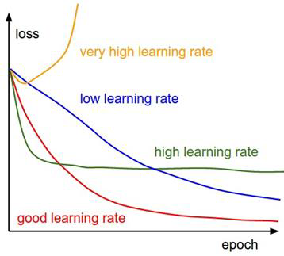

> [!Caution] 声明
> 笔记内容基于斯坦福大学的CS231n课程（[Stanford CS231n: Deep Learning for Computer Vision](http://cs231n.stanford.edu/)），主要内容是关于计算机视觉和深度学习的相关知识。
> 文中使用的代码示例和图像均来自课程资料，版权归原作者所有。
> 本笔记旨在帮助学习者更好地理解课程内容，任何转载或引用请注明出处，不涉及商业用途。如有任何版权问题，请联系我进行处理。

书接上回，我们讲到线性分类器的基本原理，并且通过损失函数来衡量模型的好坏。接下来，我们将继续深入探讨如何通过优化算法来最小化损失函数，从而训练出一个好的线性分类器。同时，我们还会介绍正则化（Regularization）的概念，它是一种防止模型过拟合的方法，可以帮助我们在训练过程中获得更好的泛化能力。

### 正则化

在引入正则化之前，我们先问大家一个问题：下图中有 $f_1$ 和 $f_2$ 两个线性分类器，凭借你的直觉，谁在训练集表现更好？谁会在验证集和测试集表现更好？


很显然，$f_1$ 在训练集上表现更好，因为它能够更好地拟合训练数据。然而，$f_2$ 在验证集和测试集上的表现可能会更好，因为它没有过度拟合训练数据中的噪声和异常值，而是有着**更加平滑、简单的决策边界**。这个现象就是我们常说的过拟合（Overfitting）。过拟合是指模型在训练数据上表现得非常好，但在未见过的数据上表现很差的情况。

计算机中有一个奥卡姆定理（Occam's Razor），它告诉我们，在多个模型能够解释同一现象的情况下，我们应该选择最简单的那个模型。**正则化**就是一种通过引入额外的约束来限制模型复杂度的方法，从而帮助我们避免过拟合。

> [!Important] 正则化的数学定义
> 正则化通常通过在损失函数中添加一个正则化项来实现。假设我们的原始损失函数是 $L(W)$，其中 $W$ 是模型的参数，那么添加正则化项后的损失函数可以表示为：
> $$ L_{\text{reg}}(W) = L(W) + \lambda R(W) $$
> 其中 $\lambda$ 是正则化强度参数，$R(W)$ 是正则化项，用来衡量模型复杂度。

添加正则化项后的损失函数有两部分，前半部分对应数据损失（Data Loss），要求模型预测应当和训练数据匹配；后半部分对应正则化损失（Regularization Loss），要求模型参数应当尽可能小，防止在训练集上面表现过好。

常见的正则化方法有三种：L1正则化（L1 Regularization）、L2正则化（L2 Regularization）和弹性网络正则化（Elastic Net Regularization）。

**L1正则化：** L1正则化通过在损失函数中添加参数的绝对值来实现，即 $R(W) = \sum_{i} |W_i|$。L1正则化具有稀疏性（Sparsity），它倾向于将一些参数推向零，从而产生一个更简单的模型。

**L2正则化：** L2正则化通过在损失函数中添加参数的平方来实现，即 $R(W) = \sum_{i} W_i^2$。L2正则化具有平滑性（Smoothness），它倾向于将参数推向较小的值，但不会完全推向零。

**弹性网络正则化：** 弹性网络正则化结合了L1和L2正则化的优点，通过在损失函数中添加两者的线性组合来实现，即 $R(W) = \sum_{i} (\beta W_i^2 + |W_i|)$，其中 $\beta$ 是一个权重参数，用来控制L1和L2正则化的相对重要性。

这三种正则化的应用场景有一定区别，在使用的时候需要通过交叉验证（Cross-Validation）来选择合适的正则化方法和参数。但是，他们无一例外都是为了防止过拟合而设计的，能够帮助我们在训练过程中获得更好的泛化能力。

### 优化算法：梯度下降法

好的，讲完什么是一个好的线性分类器以后，终于来到最重要的一个问题了：

> [!Tip] 怎样找到一个更好的线性分类器？
> 给定一组训练数据，我们需要找到一组参数 $W$，使得损失函数 $L(W)$ 最小化。换句话说，我们需要找到一个优化算法来最小化损失函数。

这个问题听起来很简单，但实际上是一个非常复杂的问题。我们需要考虑到损失函数的形状、参数空间的维度以及计算资源的限制等因素。

一个最暴力的想法就是**随机搜索**（Random Search），我们可以随机生成一组参数 $W$，计算损失函数 $L(W)$ 的值，然后不断地重复这个过程，直到找到一个足够好的参数组合。这种方法虽然简单，但效率非常低下，尤其是在高维参数空间中。同时，它也没有利用到损失函数的结构信息，无法指导我们朝着更好的方向搜索。

那么怎么找到一个更好的线性分类器呢？我们不妨想象一个实际场景：假设你在一个山地中徒步，想要尽快地到达山谷的最低点。你可以选择随机地在山地中走动，看看能不能找到一个更低的地方，但这显然不是一个高效的方法。

一个更加有效的方法是：你先观察周围的地形，找到一个下降最快的方向，然后沿着这个方向前进一段距离，再次观察周围的地形，继续沿着下降最快的方向前进。通过不断地重复这个过程，当你发现自己已经到了一个四周都是上坡的地方时，你就可以停下来，认为自己已经找到了一个局部最小值。

这个方法就是我们在优化算法中常用的**梯度下降**（Gradient Descent）算法。梯度下降算法通过计算损失函数的梯度（Gradient），来指导我们朝着损失函数值更小的方向前进。

> [!Important] 梯度下降算法的数学定义
> 已知损失函数 $L(W)$，梯度下降算法的更新规则可以表示为：
> $$ W := W - \eta \nabla L(W) $$
> 其中 $\eta$ 是学习率（Learning Rate，又称步长 Step Size），$\nabla L(W)$ 是损失函数 $L(W)$ 关于参数 $W$ 的梯度。

这个规则第一眼看起来有些过于抽象，我们先举一个简单的一维函数的例子来说明。假如有一个函数：
$$ L(w) = w^2 + 4w + 4 $$
我们可以计算出它的梯度，也就是它的导数：
$$ \nabla L(w) = 2w + 4 $$
假设我们从一个初始点 $w_0 = 0$ 开始，选择一个学习率 $\eta = 0.4$，我们可以按照梯度下降算法的更新规则来迭代地更新参数 $w$：

1. 计算梯度：$\nabla L(w_0) = 2 \cdot 0 + 4 = 4$
2. 更新参数：$w_1 = w_0 - \eta \nabla L(w_0) = 0 - 0.4 \cdot 4 = -1.6$
3. 计算梯度：$\nabla L(w_1) = 2 \cdot (-1.6) + 4 = 0.8$
4. 更新参数：$w_2 = w_1 - \eta \nabla L(w_1) = -1.6 - 0.4 \cdot 0.8 = -1.92$
5. 计算梯度：$\nabla L(w_2) = 2 \cdot (-1.92) + 4 = 0.16$
6. 更新参数：$w_3 = w_2 - \eta \nabla L(w_2) = -1.92 - 0.4 \cdot 0.16 = -1.984$
7. 计算梯度：$\nabla L(w_3) = 2 \cdot (-1.984) + 4 = 0.032$
8. 更新参数：$w_4 = w_3 - \eta \nabla L(w_3) = -1.984 - 0.4 \cdot 0.032 = -1.9968$

通过不断地迭代，我们可以看到参数 $w$ 逐渐接近函数的最小值点 $w = -2$，同时损失函数的值也在不断地减小。

考虑到 $W$ 是一个高维参数张量，我们再举一个二维函数的例子来说明。假设有一个函数：
$$ L(w_1, w_2) = w_1^2 + w_2^2 + 4w_1 + 4w_2 + 8 $$
我们可以计算出它的梯度：
$$ \nabla L(w_1, w_2) = \begin{bmatrix} 2w_1 + 4 \\ 2w_2 + 4 \end{bmatrix} $$
同样地，我们可以从一个初始点 $(w_1, w_2) = (0, 0)$ 开始，选择一个学习率 $\eta = 0.4$，按照梯度下降算法的更新规则来迭代地更新参数 $(w_1, w_2)$：

1. 计算梯度：$\nabla L(0, 0) = \begin{bmatrix} 4 \\ 4 \end{bmatrix}$
2. 更新参数：$(w_1, w_2)_1 = (0, 0) - 0.4 \cdot \begin{bmatrix} 4 \\ 4 \end{bmatrix} = (-1.6, -1.6)$
3. 计算梯度：$\nabla L(-1.6, -1.6) = \begin{bmatrix} 2 \cdot (-1.6) + 4 \\ 2 \cdot (-1.6) + 4 \end{bmatrix} = \begin{bmatrix} 0.8 \\ 0.8 \end{bmatrix}$
4. 更新参数：$(w_1, w_2)_2 = (-1.6, -1.6) - 0.4 \cdot \begin{bmatrix} 0.8 \\ 0.8 \end{bmatrix} = (-1.92, -1.92)$
5. 计算梯度：$\nabla L(-1.92, -1.92) = \begin{bmatrix} 2 \cdot (-1.92) + 4 \\ 2 \cdot (-1.92) + 4 \end{bmatrix} = \begin{bmatrix} 0.16 \\ 0.16 \end{bmatrix}$
6. 更新参数：$(w_1, w_2)_3 = (-1.92, -1.92) - 0.4 \cdot \begin{bmatrix} 0.16 \\ 0.16 \end{bmatrix} = (-1.984, -1.984)$
7. 计算梯度：$\nabla L(-1.984, -1.984) = \begin{bmatrix} 2 \cdot (-1.984) + 4 \\ 2 \cdot (-1.984) + 4 \end{bmatrix} = \begin{bmatrix} 0.032 \\ 0.032 \end{bmatrix}$
8. 更新参数：$(w_1, w_2)_4 = (-1.984, -1.984) - 0.4 \cdot \begin{bmatrix} 0.032 \\ 0.032 \end{bmatrix} = (-1.9968, -1.9968)$

通过不断地迭代，我们可以看到参数 $(w_1, w_2)$ 逐渐接近函数的最小值点 $(w_1, w_2) = (-2, -2)$，同时损失函数的值也在不断地减小。

那么，给定一个函数和一个坐标，我们怎么计算它的梯度呢？有两种方法。一种是利用解析方法（Analytical Method），通过对函数进行求导，直接计算出梯度的表达式，然后在给定的坐标处计算出梯度的数值。另一种方法是利用数值方法（Numerical Method），利用导数、偏导数和梯度的定义，在给定的坐标附近进行微小的扰动，近似计算出梯度的数值。

总之，如果用一个算法来表示梯度下降算法的话，可以表示为：

```python
def gradient_descent(L, W, learning_rate, num_iterations):
    for i in range(num_iterations):
        grad = compute_gradient(L, W)  # 计算损失函数 L 关于参数 W 的梯度
        W = W - learning_rate * grad  # 更新参数 W
    return W
```

### 随机梯度下降法

如果我们直接使用梯度下降算法来优化损失函数，可能会遇到一些问题。最大的问题是计算梯度的代价非常高，尤其是在训练数据集非常大的情况下。每次迭代都需要计算整个训练数据集上的损失函数和梯度，这会导致训练过程非常慢。

为了克服这个问题，我们可以使用**随机梯度下降**（Stochastic Gradient Descent，SGD）算法。随机梯度下降算法的核心思想是：在每次迭代中，我们**只使用一个样本或者一个小批量（Mini-batch）的样本来计算损失函数和梯度**，而不是使用整个训练数据集。这样做的好处是：每次迭代的计算代价大大降低，从而加快了训练过程。同时，随机梯度下降算法还具有一定的随机性，这有助于跳出局部最小值，找到更好的全局最小值。

如果用一个算法来表示随机梯度下降算法的话，可以表示为：

```python
def stochastic_gradient_descent(L, W, learning_rate, num_iterations, batch_size):
    for i in range(num_iterations):
        batch = sample_batch(training_data, batch_size)  # 从训练数据中随机采样一个小批量
        grad = compute_gradient(L, W, batch)  # 计算损失函数 L 关于参数 W 的梯度，使用小批量数据
        W = W - learning_rate * grad  # 更新参数 W
    return W
```

这个方法很显然大幅度降低了每次迭代的计算代价，同时也引入了一定的随机性，有助于找到更好的全局最小值。不过他仍然存在一些问题：

**1. 梯度差异**：如果不同参数的梯度值差异很大，可能会导致训练过程不稳定，甚至发散。梯度的方向会频繁地改变，导致参数更新的方向不一致，从而无法收敛到一个好的解。


**2. 局部最小值**：随机梯度下降算法可能会陷入局部最小值，无法找到全局最小值。尤其是在高维参数空间中，局部最小值的数量可能非常多，这会导致训练过程非常困难。


在高维空间中，一个局部最小值可能是一个鞍点（Saddle Point），它在某些方向上是一个最小值，在另一些方向上是一个最大值。随机梯度下降算法可能会在鞍点附近徘徊，无法找到一个好的解。


**3. 随机噪声**：由于随机梯度下降算法每次迭代只使用一个样本或者一个小批量的样本来计算损失函数和梯度，因此它引入了一定的随机噪声。这种随机噪声可能会导致训练过程不稳定，甚至发散。尤其是在训练数据集非常大的情况下，随机噪声可能会非常大，从而导致训练过程非常困难。

为了克服这些问题，我们引入了一些改进的优化算法，如动量法（SGD with Momentum）、RMSProp和Adam等。这些算法通过引入动量项、调整学习率或者结合了动量和自适应学习率的方法，来加速训练过程，稳定训练过程，并且帮助我们找到更好的全局最小值。

### 动量法

**动量法**通过引入一个动量项来加速训练过程，动量项可以看作是之前梯度的指数加权平均值，它能够帮助我们在梯度方向上保持一定的惯性，从而加速训练过程。

> [!Important] 动量法的数学定义
> 已知损失函数 $L(W)$，动量法的更新规则可以表示为：
> $$ v_{t+1} = \rho v_t + \nabla L(W_t) $$
> $$ W_{t+1} = W_t - \alpha v_{t+1} $$

其中 $\rho$ 是动量衰减率（Momentum Decay Rate，常取 0.9），$\alpha$ 是学习率，$v_t$ 是动量项，$\nabla L(W_t)$ 是损失函数 $L(W)$ 关于参数 $W$ 的梯度。动量法通过引入动量项，能够帮助我们在梯度方向上保持一定的惯性，从而加速训练过程，尤其是在梯度值较小或者梯度方向频繁改变的情况下。

这个想法其实很好理解。想象你有一辆小车，你想要让它从山顶滚到山谷的最低点。当它开始下降以后，它会具有一定的动量，这个动量会帮助它继续向下滚动，同时维持一定的方向和速度。如果它经过一些方向多变的乱石堆，它也不容易受到太大的影响，能够继续向下滚动，最终到达山谷的最低点。

如果用一个算法来表示动量法的话，可以表示为：

```python
def momentum(L, W, learning_rate, num_iterations, momentum_decay):
    v = 0  # 初始化动量项
    for i in range(num_iterations):
        grad = compute_gradient(L, W)  # 计算损失函数 L 关于参数 W 的梯度
        v = momentum_decay * v + grad  # 更新动量项
        W = W - learning_rate * v  # 更新参数 W
    return W
```

### RMSProp

**RMSProp**（Root Mean Square Propagation）算法通过引入一个自适应学习率来加速训练过程，自适应学习率可以看作是之前梯度的平方的指数加权平均值，它能够帮助我们在不同参数上使用不同的学习率，从而加速训练过程。

> [!Important] RMSProp的数学定义
> 已知损失函数 $L(W)$，RMSProp的更新规则可以表示为：
> $$ s_{t+1} = \beta s_t + (1 - \beta) \nabla L(W_t)^2 $$
> $$ W_{t+1} = W_t - \frac{\alpha}{\sqrt{s_{t+1} + \epsilon}} \nabla L(W_t) $$

其中 $\beta$ 是衰减率（Decay Rate，常取 0.9），$\alpha$ 是学习率，$s_t$ 是自适应学习率项，$\nabla L(W_t)$ 是损失函数 $L(W)$ 关于参数 $W$ 的梯度，$\epsilon$ 是一个小常数，用来防止除零错误。RMSProp通过引入自适应学习率，能够帮助我们在不同参数上使用不同的学习率，从而加速训练过程，尤其是在梯度值较大或者梯度方向频繁改变的情况下。如果梯度值比较大，那么自适应学习率就会比较小，从而减缓参数更新的速度；如果梯度值比较小，那么自适应学习率就会比较大，从而加快参数更新的速度。

RMSProp和动量法的区别在于：**动量法通过引入动量项来加速训练过程，而RMSProp通过引入自适应学习率来加速训练过程**。动量法能够帮助我们在梯度方向上保持一定的惯性，从而加速训练过程，尤其是在梯度值较小或者梯度方向频繁改变的情况下；而RMSProp能够帮助我们在不同参数上使用不同的学习率，从而加速训练过程，尤其是在梯度值较大或者梯度方向频繁改变的情况下。

用一个算法来表示RMSProp的话，可以表示为：

```python
def rmsprop(L, W, learning_rate, num_iterations, decay_rate):
    s = 0  # 初始化自适应学习率项
    for i in range(num_iterations):
        grad = compute_gradient(L, W)  # 计算损失函数 L 关于参数 W 的梯度
        s = decay_rate * s + (1 - decay_rate) * grad**2  # 更新自适应学习率项
        W = W - learning_rate / (np.sqrt(s) + epsilon) * grad  # 更新参数 W
    return W
```

### Adam

Adam（Adaptive Moment Estimation）算法结合了动量法和RMSProp的优点，通过引入动量项和自适应学习率来加速训练过程。它的核心思路是：在每次迭代中，计算损失函数的梯度，并且同时计算动量项和自适应学习率项，然后根据这两个项来更新参数。

> [!Important] Adam的数学定义
> 已知损失函数 $L(W)$，Adam的更新规则可以表示为：
> $$ m_{t+1} = \beta_1 m_t + (1 - \beta_1) \nabla L(W_t) $$
> $$ v_{t+1} = \beta_2 v_t + (1 - \beta_2) \nabla L(W_t)^2 $$
> $$ \hat{m}_{t+1} = \frac{m_{t+1}}{1 - \beta_1^{t+1}} $$
> $$ \hat{v}_{t+1} = \frac{v_{t+1}}{1 - \beta_2^{t+1}} $$
> $$ W_{t+1} = W_t - \frac{\alpha}{\sqrt{\hat{v}_{t+1}} + \epsilon} \hat{m}_{t+1} $$

其中 $\beta_1$ 是动量衰减率（Momentum Decay Rate，常取 0.9），$\beta_2$ 是自适应学习率衰减率（Adaptive Learning Rate Decay Rate，常取 0.999），$\alpha$ 是学习率（常设置为 0.001），$m_t$ 是动量项，$v_t$ 是自适应学习率项，$\hat{m}_{t+1}$ 是动量项的偏置修正（Bias-Corrected Momentum），$\hat{v}_{t+1}$ 是自适应学习率项的偏置修正（Bias-Corrected Adaptive Learning Rate），$\nabla L(W_t)$ 是损失函数 $L(W)$ 关于参数 $W$ 的梯度，$\epsilon$ 是一个小常数，用来防止除零错误。Adam通过结合动量法和RMSProp的优点，能够帮助我们在训练过程中更快地收敛到一个好的解，同时也能够在不同参数上使用不同的学习率，从而加速训练过程。

用更形象的方法来理解的话，$m_t$ 决定了小球的动量，帮助小球在梯度方向上保持一定的惯性，冲出平坦区域或者局部最小值；$v_t$ 决定了小球的步长，根据小球历史梯度的大小来调整步长，帮助小球在陡峭区域减速，在平坦区域加速；$\hat{m}_{t+1}$ 和 $\hat{v}_{t+1}$ 是对 $m_{t+1}$ 和 $v_{t+1}$ 的偏置修正，防止在算法初期由于动量项和自适应学习率项的初始值为零而导致的偏差；最后，参数更新的公式结合了动量项和自适应学习率项，帮助小球在训练过程中更快地收敛到一个好的解。

如果用一个算法来表示Adam的话，可以表示为：

```python
def adam(L, W, learning_rate, num_iterations, beta1, beta2):
    m = 0  # 初始化动量项
    v = 0  # 初始化自适应学习率项
    for t in range(num_iterations):
        grad = compute_gradient(L, W)  # 计算损失函数 L 关于参数 W 的梯度
        m = beta1 * m + (1 - beta1) * grad  # 更新动量项
        v = beta2 * v + (1 - beta2) * grad**2  # 更新自适应学习率项
        m_hat = m / (1 - beta1**(t + 1))  # 偏置修正动量项
        v_hat = v / (1 - beta2**(t + 1))  # 偏置修正自适应学习率项
        W = W - learning_rate / (np.sqrt(v_hat) + epsilon) * m_hat  # 更新参数 W
    return W
```

### 怎样选择一个好的学习率？

学习率作为所有优化算法中的一个重要超参数，直接影响着训练过程的稳定性和收敛速度。选择一个合适的学习率对于训练一个好的模型至关重要。如果学习率设置得太大，可能会导致训练过程发散，损失函数的值不断增加；如果学习率设置得太小，可能会导致训练过程非常慢，甚至陷入局部最小值。



那么我们应该设置大一点的学习率还是小一点的学习率呢？其实，我们不妨跳出这个二选一的思维，考虑使用一个**动态调整学习率**的方法。也就是说，我们在训练过程中根据损失函数的变化情况来动态地调整学习率。比如说，在训练初期，我们可以使用一个较大的学习率来快速地降低损失函数的值；当损失函数的值开始趋于平稳时，我们可以逐渐减小学习率，以便更精细地调整参数，找到一个更好的局部最小值。也就是说，我们可以使用一个学习率衰减（Learning Rate Decay）的方法来动态地调整学习率。

> [!Important] 常见的学习率衰减方法
> **余弦衰减（Cosine Decay）：** 学习率按照余弦函数的形式逐渐减小，适用于训练过程中需要平滑地降低学习率的情况。
> $$ \alpha_t = \frac{1}{2} \alpha_0 (1 + \cos(\frac{\pi t}{T})) $$
> 其中 $\alpha_0$ 是初始学习率，$T$ 是总迭代次数。
>
> **指数衰减（Exponential Decay）：** 学习率按照指数函数的形式逐渐减小，适用于训练过程中需要快速降低学习率的情况。
> $$ \alpha_t = \alpha_0 \cdot \gamma^t $$
> 其中 $\alpha_0$ 是初始学习率，$\gamma$ 是衰减率（常取 0.95 或 0.99），$t$ 是当前迭代次数。
>
> **分段衰减（Step Decay）：** 学习率在训练过程中按照预定的步骤逐渐减小，适用于训练过程中需要在特定迭代次数降低学习率的情况。
> $$ \alpha_t = \alpha_0 \cdot \gamma^{\lfloor \frac{t}{T} \rfloor} $$
> 其中 $\alpha_0$ 是初始学习率，$\gamma$ 是衰减率（常取 0.1），$T$ 是每隔多少迭代次数降低一次学习率。
>
> **线性衰减（Linear Decay）：** 学习率按照线性函数的形式逐渐减小，适用于训练过程中需要平滑地降低学习率的情况。
> $$ \alpha_t = \alpha_0 \cdot (1 - \frac{t}{T}) $$
> 其中 $\alpha_0$ 是初始学习率，$T$ 是总迭代次数。
>
> **平方根倒数衰减（Inverse Square Root Decay）：** 学习率按照平方根倒数函数的形式逐渐减小，适用于训练过程中需要在初期快速降低学习率，后期逐渐减小学习率的情况。
> $$ \alpha_t = \frac{\alpha_0}{\sqrt{t}} $$
> 其中 $\alpha_0$ 是初始学习率，$t$ 是当前迭代次数。

不过，有一个小问题：在训练刚开始的时候，由于模型不能很好地理解训练数据，损失函数的值可能会非常大，这时候如果我们使用一个较大的学习率来快速地降低损失函数的值，可能会导致训练过程发散。为了克服这个问题，我们可以在训练初期使用一个较小的学习率来稳定训练过程，然后在损失函数的值开始趋于平稳时，再逐渐增大学习率，以便更快地降低损失函数的值。也就是说，我们可以使用一个学习率预热（Learning Rate Warmup）的方法来动态地调整学习率。


比如，我们可以在训练的前 10% 的迭代次数内，使用一个线性增长的学习率，从一个较小的值逐渐增大到初始学习率 $\alpha_0$，然后在后续的迭代中使用一个学习率衰减的方法（比如，余弦衰减）来动态地调整学习率。这样做的好处是：在训练初期，我们可以使用一个较小的学习率来稳定训练过程，避免损失函数的值过大导致训练过程发散；当损失函数的值开始趋于平稳时，我们可以逐渐增大学习率，以便更快地降低损失函数的值。

### 结论，以及新的问题

好的，我们已经介绍了正则化和优化的基本概念，以及一些常见的优化算法，如梯度下降法、随机梯度下降法、动量法、RMSProp和Adam等。同时，我们还讨论了如何选择一个更好的学习率，以及一些动态调整学习率的方法，如学习率衰减和学习率预热等。

但是，正如我们在上一节线性分类器中提到的，线性分类器虽然简单，但它的表达能力有限，无法捕捉到数据中的复杂模式和关系。因此，我们需要引入一些非线性的元素来增强模型的表达能力，从而能够更好地拟合训练数据，并且在测试数据上表现更好。

同时，更复杂的模型意味着更复杂的表达式，也意味着它的梯度更难计算。我们需要引入一些新的工具来帮助我们计算梯度，从而能够使用优化算法来训练这些更复杂的模型。

欲知后事如何，请听下回分解……

### 附录：导数、偏导数和梯度

导数是一个函数在某一点的瞬时变化率，表示函数在该点的斜率。对于一个一维函数 $f(x)$，它的导数可以表示为：
$$ f'(x) = \lim_{h \to 0} \frac{f(x + h) - f(x)}{h} $$

导数的几何意义是函数图像在某一点的切线斜率，表示函数在该点的变化趋势。形象地说，如果导数为正，函数在该点是递增的；如果导数为负，函数在该点是递减的；如果导数为零，函数在该点可能是一个极值点（最大值或最小值）。

高阶导数可以理解为导数的导数，表示函数在某一点的变化率的变化率。对于一个一维函数 $f(x)$，它的二阶导数可以表示为：
$$ f''(x) = \lim_{h \to 0} \frac{f'(x + h) - f'(x)}{h} $$

二阶导数的几何意义是函数图像在某一点的曲率，表示函数在该点的弯曲程度。形象地说，如果二阶导数为正，函数在该点是向上的弯曲；如果二阶导数为负，函数在该点是向下的弯曲；如果二阶导数为零，函数在该点可能是一个拐点。

偏导数是一个多变量函数在某个变量上的导数，表示函数在该变量上的变化率。对于一个二维函数 $f(x, y)$，它的偏导数可以表示为：
$$ \frac{\partial f}{\partial x} = \lim_{h \to 0} \frac{f(x + h, y) - f(x, y)}{h} $$
$$ \frac{\partial f}{\partial y} = \lim_{h \to 0} \frac{f(x, y + h) - f(x, y)}{h} $$

偏导数的几何意义是函数图像在某个变量方向上的切线斜率，表示函数在该变量上的变化趋势。形象地说，如果偏导数为正，函数在该变量方向上是递增的；如果偏导数为负，函数在该变量方向上是递减的；如果偏导数为零，函数在该变量方向上可能是一个极值点。

梯度是一个多变量函数在所有变量上的偏导数组成的向量，表示函数在各个变量方向上的变化率。对于一个二维函数 $f(x, y)$，它的梯度可以表示为：
$$ \nabla f(x, y) = \begin{bmatrix} \frac{\partial f}{\partial x} \\ \frac{\partial f}{\partial y} \end{bmatrix} $$

如果函数有 $n$ 个变量，那么它的梯度可以表示为一个 $n$ 维向量：
$$ \nabla f(x_1, x_2, \ldots, x_n) = \begin{bmatrix} \frac{\partial f}{\partial x_1} \\ \frac{\partial f}{\partial x_2} \\ \vdots \\ \frac{\partial f}{\partial x_n} \end{bmatrix} $$

梯度的几何意义是函数图像在所有变量方向上的切线斜率，表示函数在各个变量方向上的变化趋势。它指向的方向是函数值增加最快的方向，梯度的负方向则是函数值减少最快的方向。因此，在优化算法中，我们通常沿着梯度的负方向前进，以最小化损失函数的值。

### 附录：一阶优化和二阶优化

在优化算法中，我们通常将算法分为一阶优化算法和二阶优化算法。一阶优化算法只使用损失函数的梯度信息来更新参数，而二阶优化算法则使用损失函数的二阶导数（Hessian矩阵）来更新参数。

一阶优化算法的代表是梯度下降法（Gradient Descent），它通过计算损失函数的梯度来指导参数更新。二阶优化算法的代表是牛顿法（Newton's Method），它通过计算损失函数的二阶导数来指导参数更新。

> [!Important] 牛顿法的数学定义
> 已知损失函数 $L(W)$，牛顿法的更新规则可以表示为：
> $$ W_{t+1} = W_t - H^{-1} \nabla L(W_t) $$
> 其中 $H$ 是损失函数 $L(W)$ 的 Hessian 矩阵，$\nabla L(W_t)$ 是损失函数 $L(W)$ 在参数 $W_t$ 处的梯度。


牛顿法是基于二阶泰勒展开：

$$ \begin{aligned} L(W_{t+1}) &\approx L(W_t) \\ &+ \nabla L(W_t)^T (W_{t+1} - W_t) \\ &+ \frac{1}{2} (W_{t+1} - W_t)^T H(W_t) (W_{t+1} - W_t) \end{aligned} $$

其中 $H(W_t)$ 是损失函数 $L(W)$ 在参数 $W_t$ 处的 Hessian 矩阵。

> [!Note] 泰勒展开和 Hessian 矩阵
> **泰勒展开（Taylor Expansion）**：对于一个在点 $a$ 处具有足够多阶导数的函数 $f(x)$，它可以在点 $a$ 附近表示为一个无穷级数：
> $$ f(x) = f(a) + f'(a)(x - a) + \frac{f''(a)}{2!}(x - a)^2 + \frac{f'''(a)}{3!}(x - a)^3 + \cdots $$
> 其中 $f'(a)$ 是函数 $f(x)$ 在点 $a$ 处的一阶导数，$f''(a)$ 是函数 $f(x)$ 在点 $a$ 处的二阶导数，依此类推。
> 
> **Hessian 矩阵**：对于一个多变量函数 $f(x_1, x_2, \ldots, x_n)$，它的 Hessian 矩阵是一个 $n \times n$ 的矩阵，表示函数在各个变量方向上的二阶导数。Hessian 矩阵的元素可以表示为：
> $$ H_{ij} = \frac{\partial^2 f}{\partial x_i \partial x_j} $$
> 其中 $H_{ij}$ 是函数 $f(x_1, x_2, \ldots, x_n)$ 关于变量 $x_i$ 和 $x_j$ 的二阶导数。
> 
> **高维函数的泰勒展开**：对于一个在点 $a$ 处具有足够多阶导数的多变量函数 $f(x_1, x_2, \ldots, x_n)$，它可以在点 $a$ 附近表示为一个无穷级数：
> $$ \begin{aligned} f(x_1, x_2, \ldots, x_n) &\approx f(a_1, a_2, \ldots, a_n) \\ &+ \nabla f(a)^T (x - a) \\ &+ \frac{1}{2} (x - a)^T H(a) (x - a) \\ &+ \frac{1}{6} (x - a)^T H(a) (x - a)^2 \\ &+ \cdots \end{aligned} $$

牛顿法通过使用二阶导数信息，能够更快地收敛到一个好的解，尤其是在损失函数的曲率较大的情况下。然而，牛顿法的计算代价非常高，因为它需要计算和存储 Hessian 矩阵，这在高维参数空间中可能是不可行的。因此，在实际应用中，我们通常使用一些近似的二阶优化算法，如拟牛顿法（Quasi-Newton Methods）或者共轭梯度法（Conjugate Gradient Methods），来在保持较快收敛速度的同时降低计算代价。
