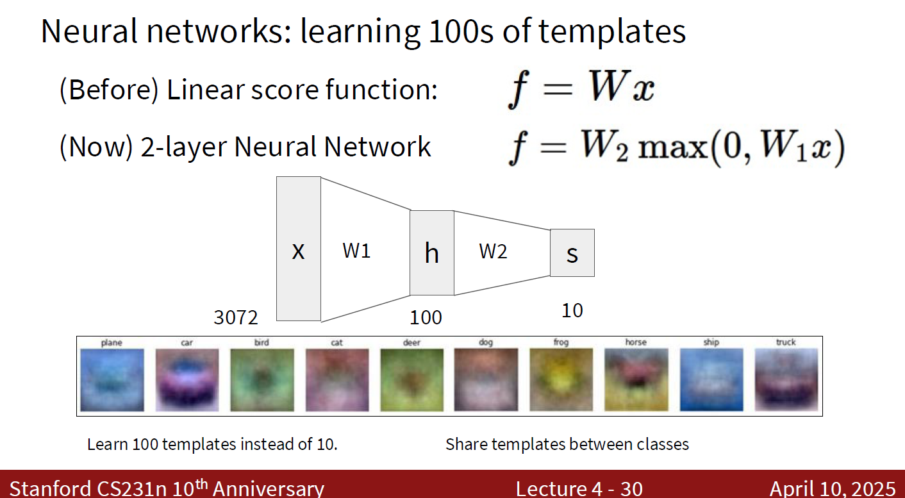
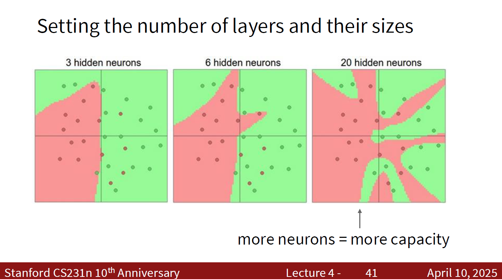

> [!Caution] 声明
> 笔记内容基于斯坦福大学的CS231n课程（[Stanford CS231n: Deep Learning for Computer Vision](http://cs231n.stanford.edu/)），主要内容是关于计算机视觉和深度学习的相关知识。文中使用的代码示例和图像均来自课程资料，版权归原作者所有。本笔记旨在帮助学习者更好地理解课程内容，任何转载或引用请注明出处，不涉及商业用途。如有任何版权问题，请联系我进行处理。

上一回我们讲到，线性分类器的一个重要缺点就在于它只能学习线性决策边界。对于一些复杂的分类任务，线性分类器可能无法很好地拟合数据，从而导致较高的训练误差和测试误差。

比如说，我们有左下图这样的一个数据集：

图中基本上两类数据形成了一个同心圆的结构。这个数据集看起来非常好区分：只需要一个圆形的决策边界就可以把两类数据分开了。但是如果我们使用一个线性分类器来拟合这个数据集，那么它就无法找到一个合适的决策边界来区分这两类数据了。

而如果我们引入非线性的特征变换，比如说我们把每个数据点的平面直角坐标变换成极坐标，那么我们就可以把这个数据集变成一个线性可分的数据集了，如右上图所示。

由此，我们就引入了非线性特征变换的概念。通过对输入数据进行非线性的变换，我们可以把原本线性不可分的数据集变成线性可分的数据集，从而使得线性分类器能够更好地拟合数据。

### 一个简单的非线性分类器

讲完为什么要引入非线性特征变换之后，我们就可以引入非线性分类器了。非线性分类器的一个重要特点就是它们能够学习非线性的决策边界，从而更好地拟合复杂的数据集。

我们来举一个最简单的非线性分类器的例子：首先进行线性变换，然后将结果中的负数全部置为0，最后再进行一次线性变换，输出结果。

> [!Important] 简单非线性分类器的数学模型
> 已知输入数据为 $x \in \mathbb{R}^D$，第一次线性变换的权重矩阵为 $W_1 \in \mathbb{R}^{D \times H}$，第二次线性变换的权重矩阵为 $W_2 \in \mathbb{R}^{H \times C}$，则简单非线性分类器的输出可以表示为：
> $$ y = W_2 \cdot \max(0, W_1 x) $$
> 
> 如果令 $h = \max(0, W_1 x) \in \mathbb{R}^H$，则上式可以简化为：
> 
> $$ y = W_2 h $$

在这个非线性分类器中，我们使用了取最值函数 $\max(0, \cdot)$ 来引入非线性。这个函数也被称为**ReLU**（Rectified Linear Unit），它的作用是将输入中的负数全部置为0，而正数保持不变。通过引入ReLU，我们就能够让模型学习到非线性的决策边界，从而更好地拟合复杂的数据集。

一个很自然而然的想法是：我们是否可以使用其他的非线性函数呢？答案是当然可以。我们一般把这种非线性函数叫做激活函数（Activation Function）。除了ReLU之外，还有很多其他的激活函数，比如说Sigmoid、Tanh等。不同的激活函数有不同的特点和适用场景，我们会在后续的内容中介绍它们。

> [!Note] 常见的激活函数
> **ReLU（Rectified Linear Unit）**：$f(x) = \max(0, x)$，当输入为负数时输出为0，当输入为正数时输出为输入本身。ReLU是目前最常用的激活函数之一，因为它在训练深度神经网络时表现出色，能够有效地缓解梯度消失问题。
>
> **Sigmoid**：$f(x) = \frac{1}{1 + e^{-x}}$，输出范围在0到1之间，常用于二分类问题的输出层。
>
> **Tanh**：$f(x) = \frac{e^x - e^{-x}}{e^x + e^{-x}}$，输出范围在-1到1之间，常用于隐藏层的激活函数。
>
> 

回到前面的简单非线性分类器，我们来分析一下它的结构。这个模型由两层线性变换和一个非线性激活函数组成。第一层线性变换将输入数据从 $D$ 维映射到 $H$ 维，第二层线性变换将 $H$ 维的特征映射到 $C$ 维的输出空间，其中 $C$ 是类别数。

欸，这个简单非线性分类器的结构和前面的线性分类器比起来优势在哪里呢？我们前面从代数、视觉、几何三个角度来分析线性分类器的工作机制，这里我们不妨也从这三个角度来分析一下简单非线性分类器的工作机制，并且看看它是如何克服线性分类器的限制的。

### 从代数角度理解简单非线性分类器

从代数角度来说，简单非线性分类器的第一层线性变换将输入数据映射到一个新的特征空间中，这个特征空间中的每个维度都是输入数据的一个线性组合。然后，激活函数引入了非线性，使得模型能够学习到更复杂的特征表示。最后，第二层线性变换将这些复杂的特征映射到输出空间中，从而实现分类。

一个很直接的问题是：为什么引入非线性函数可以从代数角度让模型学习到更复杂的特征表示呢？这是因为线性变换只能学习到输入数据的线性组合，而非线性函数可以引入更多的自由度，使得模型能够学习到输入数据的非线性组合，从而更好地拟合复杂的数据集。

那么这个非线性分类器可以学习到和线性分类器一样的决策边界吗？答案是当然可以。因为**线性分类器是简单非线性分类器的一个特例**，当我们把激活函数设置为恒等函数（即 $f(x) = x$）时，我们的简单非线性分类器就退化成了线性分类器了。因此，简单非线性分类器不仅能够学习到线性分类器能够学习到的决策边界，还能够学习到更多的非线性决策边界，从而更好地拟合复杂的数据集。

### 从视觉角度理解简单非线性分类器

从视觉角度来说，简单非线性分类器的第一层线性变换可以看作是对输入图片进行了一次线性变换，得到了一组新的特征图，也就是我们前面写到的 $h$。然后，激活函数引入了非线性，使得这些特征图中的一些值被置为0，而另一些值保持不变。最后，第二层线性变换将这些特征图映射到输出空间中，从而实现分类。

这组 $h$ 特征图就是简单非线性分类器可以战胜线性分类器的关键所在。我们回忆一下前面线性分类器的视觉理解：权重矩阵 $W$ 的每一行可以看作是一个类别的“模板”，当输入图片与这个模板越相似时，得分就越高，分类结果就越倾向于这个类别。

而简单非线性分类器就像是把这个过程分成了两步。第一步先从输入图片中提取出一些特征图，这些特征图可以看作是一些“基础元素”，它们可能并不直接对应于某个类别，但它们能够捕捉到输入图片中的一些重要特征，比如颜色、条纹、边框等等。权重矩阵 $W_1$ 的每一行可以看作是一个“中间模板”，而非线性激活函数可以过滤掉一些不重要的模板，从而让模型更专注于那些重要的特征图。第二部再根据这些基础元素进行逻辑组合，进行更高级的特征提取，最终得到每个类别的得分。权重矩阵 $W_2$ 的每一行可以看作是一个“最终模板”，它们根据第一层提取的特征图进行组合，从而得到每个类别的得分。

### 从几何角度理解简单非线性分类器

从几何角度来说，简单非线性分类器的第一层线性变换将输入空间中的数据点映射到一个新的特征空间中，这个特征空间中的每个维度都是输入数据的一个线性组合。然后，激活函数引入了非线性，使得模型能够学习到更复杂的决策边界。最后，第二层线性变换将这些复杂的特征映射到输出空间中，从而实现分类。

正如我们前面所说的，线性分类器只能学习到线性决策边界，而简单非线性分类器通过引入非线性函数，可以学习到更复杂的决策边界，从而更好地拟合复杂的数据集。我们可以把简单非线性分类器看作是在输入空间中引入了一个非线性的变换，这个变换将原本线性不可分的数据集变成了线性可分的数据集，从而使得模型能够找到一个合适的决策边界来区分不同的类别。

### 更复杂的非线性分类器：神经网络

我们前面介绍了一个简单的非线性分类器，它由两层线性变换和一个非线性激活函数组成。这个模型已经能够学习到一些非线性的决策边界了，但是它的表达能力还是有限的。

怎样让它学习到更复杂的决策边界呢？一个很自然的想法是：我们可以把这个简单非线性分类器堆叠起来，形成一个更深的模型。也就是说，我们可以再插入一次线性变换和一个非线性激活函数，这样就得到了一个三层的非线性分类器了。

> [!Important] 三层非线性分类器的数学模型
> 已知输入数据为 $x \in \mathbb{R}^D$，第一次线性变换的权重矩阵为 $W_1 \in \mathbb{R}^{D \times H_1}$，第二次线性变换的权重矩阵为 $W_2 \in \mathbb{R}^{H_1 \times H_2}$，第三次线性变换的权重矩阵为 $W_3 \in \mathbb{R}^{H_2 \times C}$，则三层非线性分类器的输出可以表示为：
> $$ y = W_3 \cdot \max(0, W_2 \cdot \max(0, W_1 x)) $$

> [!Warning] “三层”是怎么来的？
> 在上面的数学模型中，我们有三个线性变换：$W_1$、$W_2$ 和 $W_3$，每个线性变换都对应着一个层次。第一层是输入层 $x$ 到第一隐藏层 $h_1$ 的线性变换，第二层是第一隐藏层 $h_1$ 到第二隐藏层 $h_2$ 的线性变换，第三层是第二隐藏层 $h_2$ 到输出层的线性变换。因此，我们称这个模型为三层非线性分类器。

很显然，这个三层非线性分类器的表达能力比之前的简单非线性分类器更强了。我们可以继续堆叠更多的线性变换和非线性激活函数，形成一个更深的模型，这就是我们通常所说的神经网络（Neural Network）。

> [!Important] 神经网络的定义
> 神经网络，又称全连接网络 (fully connected network) 或者多层感知机 (multi-layer perceptron, MLP)，是一种由多层线性变换和非线性激活函数组成的模型。它通过堆叠多个层次来学习更复杂的特征表示和决策边界，从而能够更好地拟合复杂的数据集。神经网络的每一层都可以看作是一个非线性分类器，通过不断地堆叠这些非线性分类器，我们就得到了一个强大的模型，能够处理各种各样的复杂任务。
>
> 

正如我们前面所说的，神经网络的表达能力非常强大，它能够学习到非常复杂的决策边界，从而在很多任务上都取得了很好的表现。神经网络的层数越多，模型的表达能力就越强。下图中，我们依次增加了神经网络的层数，随着层数的增加，模型能够学习到更复杂的决策边界，从而更好地拟合数据集。

### 什么是一个好的神经网络

我们已经介绍了神经网络的基本结构和工作原理，那么一个重要的问题是：什么样的神经网络才是一个好的神经网络呢？我们需要的神经网络不仅能够在训练数据上表现良好，还能够在未见过的数据上有良好的泛化能力。

和线性分类器一样，我们需要一个损失函数来衡量神经网络的性能。通过最小化损失函数，我们可以优化神经网络的参数，使得模型能够更准确地进行分类。同时，我们也需要进行正则化，防止模型过拟合训练数据。

> [!Important] 神经网络的损失函数
> 给定一个数据集 $\{(x_1, y_1), (x_2, y_2), \ldots, (x_N, y_N)\}$，其中 $x_i$ 是第 $i$ 张图片，$y_i$ 是对应的标签。对于一个神经网络，我们可以定义一个损失函数 $L(W)$ 来衡量模型的性能：
> $$ L(W) = \frac{1}{N} \sum_{i=1}^{N} L_i (f(x_i; W), y_i) + \lambda R(W) $$
> 其中，$L_i (f(x_i; W), y_i)$ 是单个样本的损失函数，用来衡量模型对第 $i$ 张图片的预测结果 $f(x_i)$ 与真实标签 $y_i$ 之间的差距；$R(W)$ 是一个正则化项，用来防止模型过拟合训练数据；$\lambda$ 是一个超参数，用来控制正则化项的权重。我们希望通过调整权重矩阵 $W$ 来最小化这个损失函数，从而得到一个好的神经网络。

> [!Warning] 如何定义神经网络的正则化项？
> 和线性分类器一样，我们可以使用L1正则化、L2正则化和弹性网络正则化来定义神经网络的正则化项。L1正则化会使得模型的权重矩阵变得稀疏，从而有助于特征选择；L2正则化会使得模型的权重矩阵变得更小，从而有助于防止过拟合；弹性网络正则化则结合了L1和L2正则化的优点，既能够使得模型的权重矩阵变得稀疏，又能够使得模型的权重矩阵变得更小。
>
> 需要注意的是，**我们的正则化项不应该是模型的大小，而应该是模型参数的大小**。也就是说，我们应该对模型的权重矩阵进行正则化，而不是对模型的层数进行正则化。因为增加层数并不一定会导致模型过拟合，反而可能会提高模型的表达能力；而增加权重矩阵的大小则更有可能导致模型过拟合，因此我们应该对权重矩阵进行正则化。
>
> 

### 下一步，优化

我们已经介绍了神经网络的基本结构和损失函数，那么接下来一个重要的问题是：我们应该如何优化神经网络的参数呢？也就是说，我们应该如何调整权重矩阵 $W$ 来最小化损失函数 $L(W)$ 呢？

很显然，直接求导损失函数 $L(W)$ 并且设置导数为0来求解最优参数是不可行的，哪怕是最简单的两层非线性分类器，它的损失函数也是一个非常复杂的函数，无法通过解析的方法来求解最优参数。因此，我们需要使用数值优化的方法来优化神经网络的参数。

至于怎么优化，那就是下一讲的任务了。欲知后事如何，请听下回分解……