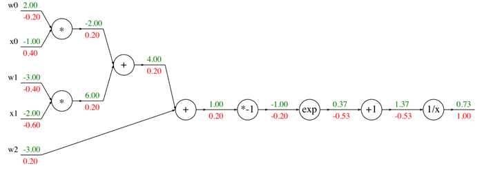
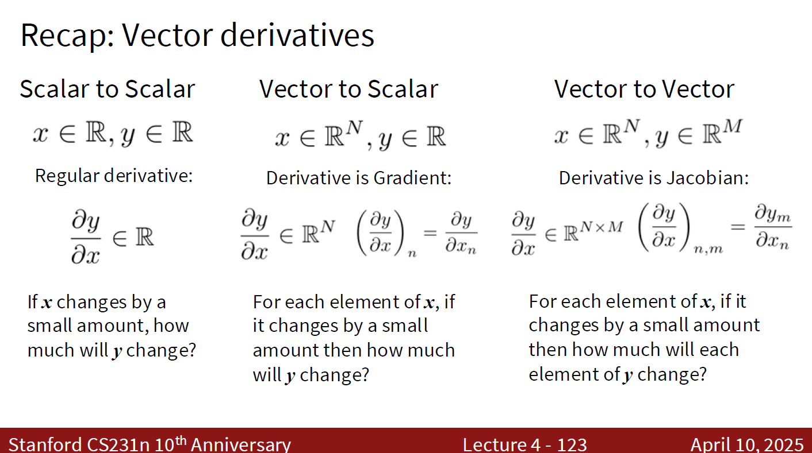
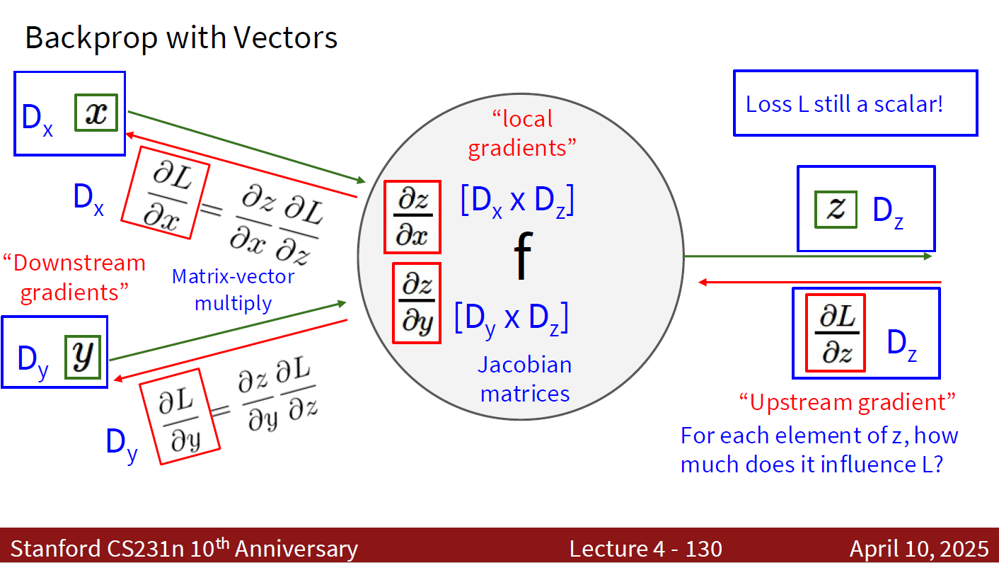
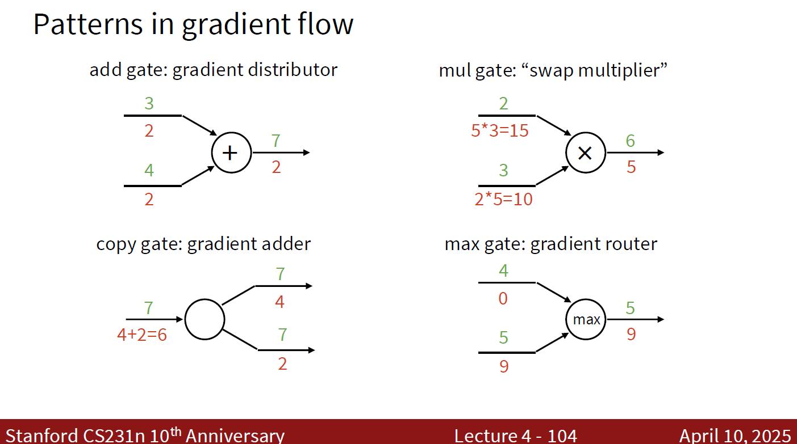

> [!Caution] 声明
> 笔记内容基于斯坦福大学的CS231n课程（[Stanford CS231n: Deep Learning for Computer Vision](http://cs231n.stanford.edu/)），主要内容是关于计算机视觉和深度学习的相关知识。文中使用的代码示例和图像均来自课程资料，版权归原作者所有。本笔记旨在帮助学习者更好地理解课程内容，任何转载或引用请注明出处，不涉及商业用途。如有任何版权问题，请联系我进行处理。

书接上回，我们从线性分类器引入了非线性分类器，并且介绍了神经网络的基本结构。介绍完神经网络的损失函数以后，我们就可以进入到神经网络的训练阶段了。

我们之前提到过线性分类器的训练过程是通过优化损失函数来实现的，那么神经网络的训练过程也是通过优化损失函数来实现的。我们需要计算损失函数关于模型参数的梯度，然后使用这些梯度来更新模型参数，从而使得损失函数的值逐渐减小。

但是这样就有一个问题了：这个梯度怎么计算呢？对于线性分类器来说，交叉熵损失函数关于模型参数的梯度是比较容易计算的，因为线性分类器的模型结构比较简单，所以我们可以使用解析方法计算梯度的表达式。但是对于有着各种非线性函数的神经网络来说，这个难度就太大了。比如一个最简单的二层非线性分类器，它的推理函数、单个样本的损失函数、正则化项、总损失函数分别是：

$$\begin{aligned}
s &= W_2 \max (W_1 x_i) = W_2 h \\
h &= \max (W_1 x_i) \\
L_i &= \sum_{j \neq y_i} \max(0, s_j - s_{y_i} + 1) \\
R(W) &= \sum_k W_k^2 \\
L &= \frac{1}{N} \sum_{i=1}^N L_i + \lambda R(W_1) + \lambda R(W_2)
\end{aligned}$$

如果我们计算损失函数 $L$ 关于模型参数 $W_1$ 和 $W_2$ 的梯度，那么我们可以写出：

$$
\begin{aligned}
\frac{\partial L}{\partial W_1} &= \frac{1}{N} \sum_{i=1}^N \frac{\partial L_i}{\partial W_1} + 2 \lambda W_1 \\
&= \frac{1}{N} \sum_{i=1}^N \sum_{j \neq y_i} \frac{\partial L_i}{\partial s_j} \frac{\partial s_j}{\partial W_1} + 2 \lambda W_1 \\
&= \frac{1}{N} \sum_{i=1}^N \sum_{j \neq y_i} \frac{\partial L_i}{\partial s_j} \frac{\partial s_j}{\partial h} \frac{\partial h}{\partial W_1} + 2 \lambda W_1 \\
&= \frac{1}{N} \sum_{i=1}^N \sum_{j \neq y_i} \frac{\partial L_i}{\partial s_j} W_2 \frac{\partial h}{\partial W_1} + 2 \lambda W_1 \\
&= \cdots
\end{aligned}
$$

这个计算可比线性分类器复杂多了，而且这只是一个最最最简单的二层非线性分类器了，如果我们有一个更深的神经网络，那么计算这个梯度就更麻烦了。现代的神经网络动辄几十层、上百层的深度了，这个梯度的计算就更麻烦了。

由此，我们就引入了一个非常重要的算法：**反向传播算法**（Backpropagation Algorithm）。

### 反向传播算法的原理

在介绍反向传播算法以前，我们先复习一下微积分中的链式法则（Chain Rule）。链式法则是微积分中的一个重要定理，它告诉我们如何计算复合函数的导数。具体来说，如果我们有一个复合函数 $f(g(x))$，其中 $f$ 和 $g$ 都是可微函数，那么链式法则告诉我们：

$$ \frac{df}{dx} = \frac{df}{dg} \cdot \frac{dg}{dx} $$

反向传播算法就是利用链式法则来计算神经网络中每一层的梯度的。具体来说，反向传播算法从输出层开始，逐层向前计算每一层的梯度，直到输入层为止。这个过程就像是一个“反向传播”的过程一样，因此得名。

我们先以一个简单的函数为例：

$$ f(x, y, z) = (x + y) z$$

如果我们想要计算它在 $x = -2, y = 5, z = -4$ 处的梯度：

$$\nabla f = \left( \frac{\partial f}{\partial x}, \frac{\partial f}{\partial y}, \frac{\partial f}{\partial z} \right)$$

那么我们可以先画出它的计算图：


其中的中间变量 $q, f$：

$$\begin{aligned}
q &= x + y \\
f &= q z
\end{aligned}$$

我们可以先写出他们对于各自直接输入的偏导数：

$$\begin{aligned}
\frac{\partial q}{\partial x} &= 1 \\
\frac{\partial q}{\partial y} &= 1 \\
\frac{\partial f}{\partial q} &= z \\
\frac{\partial f}{\partial z} &= q
\end{aligned}$$

随后我们将 $x, y, z$ 代入计算图，得到每个变量的值：


接下来我们从 $f$ 开始，**逐层**向前计算每个变量的梯度：

$$\begin{aligned}
\frac{\partial f}{\partial f} &= 1 \\
\frac{\partial f}{\partial q} &= \frac{\partial f}{\partial f} \cdot \frac{\partial f}{\partial q} = 1 \cdot z = -4 \\
\frac{\partial f}{\partial z} &= \frac{\partial f}{\partial f} \cdot \frac{\partial f}{\partial z} = 1 \cdot q = 3 \\
\frac{\partial f}{\partial x} &= \frac{\partial f}{\partial q} \cdot \frac{\partial q}{\partial x} = -4 \cdot 1 = -4 \\
\frac{\partial f}{\partial y} &= \frac{\partial f}{\partial q} \cdot \frac{\partial q}{\partial y} = -4 \cdot 1 = -4
\end{aligned}$$

这样我们就得到了函数 $f$ 在 $x = -2, y = 5, z = -4$ 处的梯度：

$$ \nabla f = \left( -4, -4, 3 \right) $$


如果我们总结一下这里的计算步骤，我们会发现：我们每一步计算一个变量的梯度的时候，都是通过它的直接输出变量的梯度乘以它对于直接输出变量的偏导数来计算的。比如说，我们计算 $\frac{\partial f}{\partial q}$ 的时候，是通过 $\frac{\partial f}{\partial f} \cdot \frac{\partial f}{\partial q}$ 来计算的；我们计算 $\frac{\partial f}{\partial x}$ 的时候，是通过 $\frac{\partial f}{\partial q} \cdot \frac{\partial q}{\partial x}$ 来计算的。这个计算过程就是反向传播算法的核心思想：**每一层的梯度都是通过它的直接输出变量的梯度乘以它对于直接输出变量的偏导数来计算的**。我们只需要从输出层向输入层一层层反向计算每一层的梯度，就可以得到整个函数的梯度了。


我们再举一个复杂一点的函数的例子：
$$ f(w, x) = \frac{1}{1 + e^{-(w_0 x_0 + w_1 x_1 + w_2)}} $$

和上面的推导过程类似，我们可以先进行正向传播计算每个变量的值，然后反向传播计算每个变量的梯度。这个过程就比较麻烦了，我们就不在这里进行详细的推导了，直接给出完整的计算图：



这里我们可以定义一个新的函数：

$$ \sigma(z) = \frac{1}{1 + e^{-z}} $$

这个函数叫做**Sigmoid函数**，它也是一个常用的非线性激活函数。我们可以将上面的函数 $f(w, x)$ 重写成：

$$ f(w, x) = \sigma(w_0 x_0 + w_1 x_1 + w_2) $$

欸，这样子整个计算图就可以变得更加简洁了。而且我们可以推导出Sigmoid函数的导数：

$$ \sigma'(z) = \sigma(z) (1 - \sigma(z)) $$

由此可见，计算图不一定是唯一的。我们可以通过引入新的变量或者函数来简化计算图的结构，从而使得反向传播算法的计算过程更加清晰和高效。

不过，上面的例子都是关于标量（Scalar）的计算的，而在实际的神经网络中，我们处理的往往是向量（Vector）或者张量（Tensor）。那么当反向传播算法遇上标量、向量、张量的时候，我们又该如何计算梯度呢？回答这个问题，需要我们首先复习一下标量、向量、张量的偏导数。

> [!Note] 标量、向量、张量的偏导数
> 

我们首先来看一下反向传播算法中的向量变量导数如何计算。比如说有一个函数 $z = f(x, y)$，其中 $x, y, z$ 分别是维度为 $D_x, D_y, D_z$ 的向量，那么我们可以定义 $z$ 关于 $x$ 的雅可比矩阵（Jacobian Matrix）：

$$ J_{z, x} = \frac{\partial z}{\partial x} = \begin{bmatrix}
\frac{\partial z_1}{\partial x_1} & \frac{\partial z_1}{\partial x_2} & \cdots & \frac{\partial z_1}{\partial x_{D_x}} \\
\frac{\partial z_2}{\partial x_1} & \frac{\partial z_2}{\partial x_2} & \cdots & \frac{\partial z_2}{\partial x_{D_x}} \\
\vdots & \vdots & \ddots & \vdots \\
\frac{\partial z_{D_z}}{\partial x_1} & \frac{\partial z_{D_z}}{\partial x_2} & \cdots & \frac{\partial z_{D_z}}{\partial x_{D_x}}
\end{bmatrix} $$

这个矩阵表示了函数 $f$ 的每个输出变量 $z_i$ 关于每个输入变量 $x_j$ 的偏导数。我们可以通过这个雅可比矩阵来计算反向传播算法中的梯度。比如说，如果我们有一个标量损失函数 $L$，我们想要计算它关于输入变量 $x$ 的梯度 $\frac{\partial L}{\partial x}$，我们可以通过链式法则来计算：

$$ \frac{\partial L}{\partial x} = \frac{\partial L}{\partial z} \cdot \frac{\partial z}{\partial x} = \frac{\partial L}{\partial z} \cdot J_{z, x} $$

其中 $\frac{\partial L}{\partial z}$ 是一个维度为 $D_z$ 的向量，$J_{z, x}$ 是一个维度为 $D_z \times D_x$ 的矩阵，所以最终的结果 $\frac{\partial L}{\partial x}$ 是一个维度为 $D_x$ 的向量，这也符合标量对向量的导数的定义。

同理，我们也可以定义 $z$ 关于 $y$ 的雅可比矩阵：

$$ J_{z, y} = \frac{\partial z}{\partial y} = \begin{bmatrix}
\frac{\partial z_1}{\partial y_1} & \frac{\partial z_1}{\partial y_2} & \cdots & \frac{\partial z_1}{\partial y_{D_y}} \\
\frac{\partial z_2}{\partial y_1} & \frac{\partial z_2}{\partial y_2} & \cdots & \frac{\partial z_2}{\partial y_{D_y}} \\
\vdots & \vdots & \ddots & \vdots \\
\frac{\partial z_{D_z}}{\partial y_1} & \frac{\partial z_{D_z}}{\partial y_2} & \cdots & \frac{\partial z_{D_z}}{\partial y_{D_y}}
\end{bmatrix} $$

由此可以计算 $z$ 关于 $y$ 的梯度：

$$ \frac{\partial L}{\partial y} = \frac{\partial L}{\partial z} \cdot \frac{\partial z}{\partial y} = \frac{\partial L}{\partial z} \cdot J_{z, y} $$

我们用计算图来表示上述过程：



我们来举一个矩阵乘法的例子：

$$ \begin{aligned}
    y &= W x \\
    y_{n, m} &= \sum_d x_{n, d} w_{d, m}
\end{aligned}$$

我们先计算 $L$ 关于 $x$ 的梯度：

$$ \begin{aligned}
    \frac{\partial L}{\partial x_{n, d}} &= \sum_m \frac{\partial L}{\partial y_{n, m}} \cdot \frac{\partial y_{n, m}}{\partial x_{n, d}} \\
    &= \sum_m \frac{\partial L}{\partial y_{n, m}} \cdot w_{d, m} \\

    \frac{\partial L}{\partial x} &= (\frac{\partial L}{\partial y}) \cdot W^T
\end{aligned} $$

随后我们计算 $L$ 关于 $W$ 的梯度：

$$\begin{aligned}
    \frac{\partial L}{\partial w_{d, m}} &= \sum_n \frac{\partial L}{\partial y_{n, m}} \cdot \frac{\partial y_{n, m}}{\partial w_{d, m}} \\
    &= \sum_n \frac{\partial L}{\partial y_{n, m}} \cdot x_{n, d} \\

    \frac{\partial L}{\partial W} &= x^T \cdot (\frac{\partial L}{\partial y})
\end{aligned}$$

### 反向传播算法的实现

在实际编程中，我们只需要对于计算图中的每一个节点（对应我们表达式中的每一个中间变量）实现它的正向传播和反向传播函数，就可以通过反向传播算法来计算整个函数的梯度了。这个节点有一个更常见的名字：**算子**（Operator）。每个算子都有一个正向传播函数和一个反向传播函数，正向传播函数用来计算输出变量的值，反向传播函数用来计算输入变量的梯度。如果你熟悉电子工程、数模电路的话，你可以把它理解成一个一个的门函数（Gate Function），整个计算图就是由这些门函数组成的电路图一样的结构。



如果我们用一个python函数来实现反向传播算法的话，我们可以写出如下的算子伪代码API：

```python
class Operator:
    def forward(self, inputs):
        save_for_backward(inputs)
        output = self.compute_forward(inputs)
        return output

    def backward(self, grad_output):
        inputs = load_from_saved()
        grad_inputs = self.compute_backward(inputs, grad_output)
        return grad_inputs
```

比如说，PyTorch中的标量乘法算子就可以实现如下：

```python
class Multiply(torch.autograd.Function):
    @staticmethod
    def forward(ctx, a, b):
        ctx.save_for_backward(a, b)
        return a * b

    @staticmethod
    def backward(ctx, grad_output):
        a, b = ctx.saved_tensors
        grad_a = grad_output * b
        grad_b = grad_output * a
        return grad_a, grad_b
```

### 总结，and what's next?

我们今天针对复杂的神经网络结构面对传统梯度表达式计算的困境，引入了反向传播算法来计算损失函数关于神经网络中各参数的梯度，借助链式法则解释了梯度如何从输出层逐层回传至输入层，并且详细展开了向量与张量的相关算子如何计算梯度。最后我们还介绍了反向传播算法的实现细节，展示了如何通过定义算子类来实现正向传播和反向传播函数，从而构建整个计算图的梯度计算机制。

反向传播算法的精髓在于：**将复杂的整体梯度计算分解为一系列局部梯度计算的乘积**。每个算子只需关心自己的前向计算和局部梯度，而整个网络的梯度则由框架自动链式合成。这种“局部化”的思想使得我们可以任意组合各种层和激活函数，构建出深度神经网络，并高效地进行训练。

至此，我们介绍完了最基本的深度学习、神经网络的概念和训练方法。我们目前所训练的神经网络都是全连接网络，作为最基础的神经网络，它结构简单而易于理解，但是对于图像、语音等具有网格结构的高维数据，它往往会面临参数爆炸、难以提取局部特征等问题。我们接下来将进入模型结构的设计，针对不同的机器学习任务，设计不同架构的神经网络。既然大标题是“深度学习与计算机视觉”，我们就先从计算机视觉的经典模型——卷积神经网络（Convolutional Neural Networks, CNNs）开始讲起。

欲知后事如何，请看下回分解……