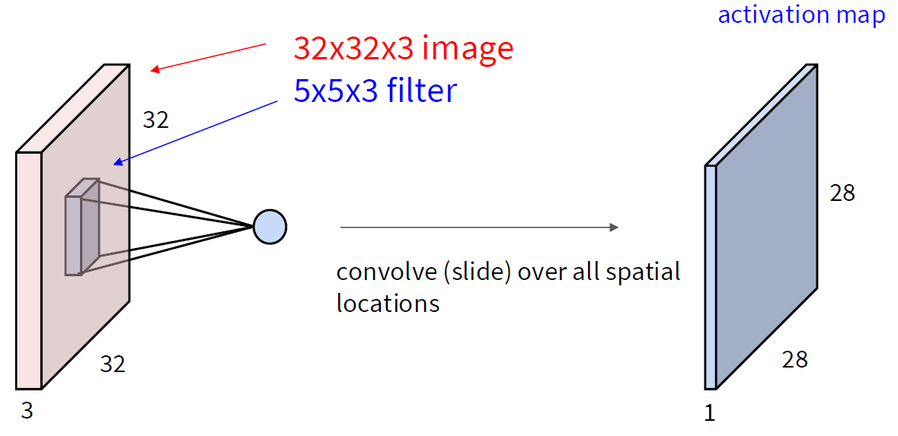
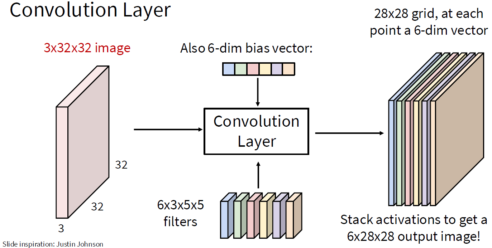
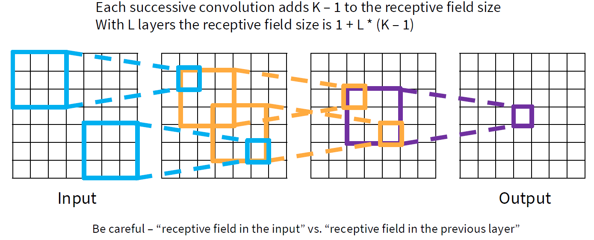
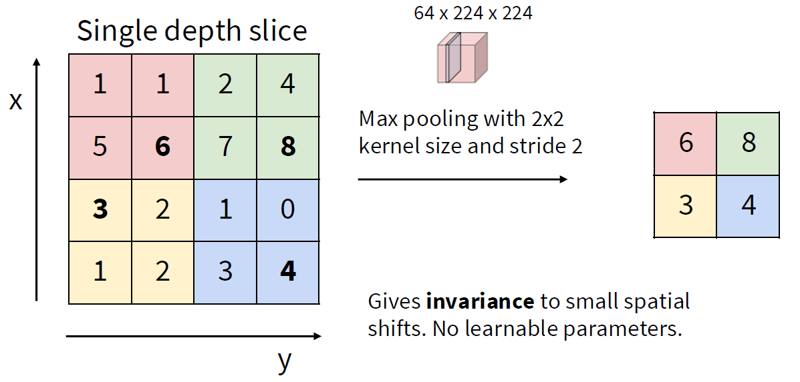
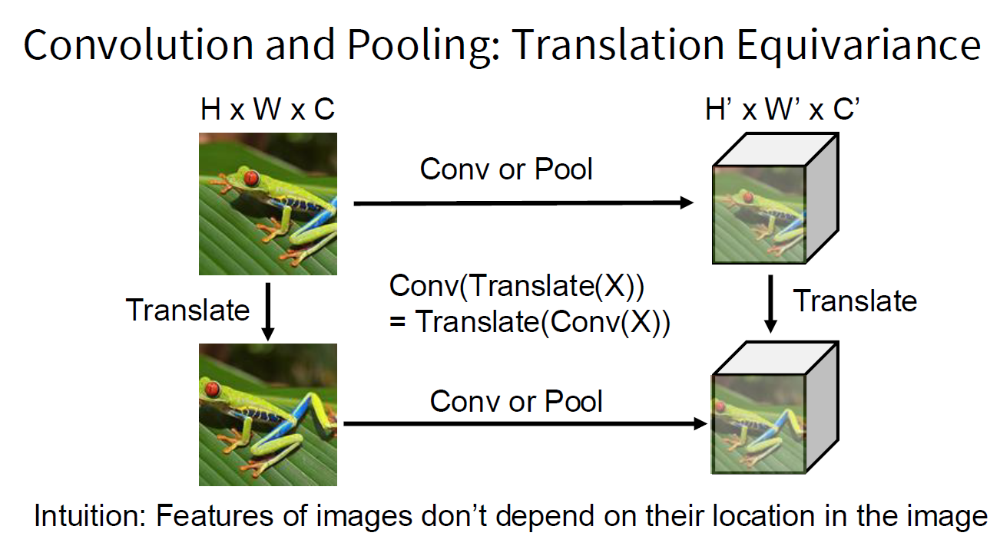

# 深度学习与计算机视觉：卷积和池化

> [!Caution] 声明
> 笔记内容基于斯坦福大学的CS231n课程（[Stanford CS231n: Deep Learning for Computer Vision](http://cs231n.stanford.edu/)），主要内容是关于计算机视觉和深度学习的相关知识。文中使用的代码示例和图像均来自课程资料，版权归原作者所有。本笔记旨在帮助学习者更好地理解课程内容，任何转载或引用请注明出处，不涉及商业用途。如有任何版权问题，请联系我进行处理。

回想一下我们前面学习过的神经网络，都只有如下两种算子：线性全连接层（Fully Connected Layer）和非线性激活函数（Non-linear Activation Function）。当我们提到用这两种算子组成的神经网络来处理图像时，我们提到过线性全连接层相当于给每一张图片进行一个模板匹配的过程。对于每一张图片，我们都要将它展平（flatten）成一个向量，然后与权重矩阵进行乘法运算，得到一个新的向量作为输出。

但是这一种方法有一个缺陷：当我们将图片展平成一个向量时，我们丢失了图片的空间结构信息。图片中的像素是有空间关系的，比如说相邻的像素可能属于同一个物体，而远离的像素可能属于不同的物体。线性全连接层无法捕捉到这种空间关系，因此在处理图像时效果不佳。

比如说我们的模板是匹配一只猫的特征，那么如果猫在图片的不同位置出现，线性全连接层可能无法正确识别它，因为它没有考虑到猫在图片中的位置关系。

由此，我们希望：能不能用一种方法保留图片的空间结构信息，使模板可以在图片的不同位置进行匹配呢？科学家和工程师们想到了一个在通信工程中很常见的概念：**卷积（Convolution）**。信号与系统中，连续时间和离散时间的卷积定义如下：

$$ y(t) = (x * h)(t) = \int_{-\infty}^{\infty} x(\tau)h(t - \tau)d\tau $$

$$ y[n] = (x * h)[n] = \sum_{m=-\infty}^{\infty} x[m]h[n - m] $$

如果我们分别对它们进行连续时间傅里叶变换和离散时间傅里叶变换，那么我们可以得到卷积定理：

$$ Y(j\omega) = X(j\omega)H(j\omega) $$

$$ Y(e^{j\omega}) = X(e^{j\omega})H(e^{j\omega}) $$

从频域角度来看，卷积相当于对输入信号进行滤波操作——也可以说，卷积相当于对输入信号的频谱进行特征匹配。我们可以将卷积看作是一种局部连接的操作，它只关注输入信号的局部区域，从而保留了空间结构信息。应用到图像处理上，卷积操作可以让我们在图片的不同位置进行模板匹配，从而捕捉到图片中的空间关系。

### 卷积层

我们先来看看最简单的卷积层。假如我们有一张 $32 \times 32 \times 3$ 的彩色图片（宽度为32像素，高度为32像素，通道数为3），我们想要用一个 $5 \times 5$ 的卷积核（Filter）来处理这张图片。这个卷积核有3个通道（对应输入图片的3个通道），所以它的尺寸是 $5 \times 5 \times 3$。

在计算的时候，我们会将这个卷积核在输入图片上进行滑动1次，每次滑动都会计算卷积核与输入图片的局部区域的点积，得到一个新的值：

$$ y = w^T x + b $$

这个点积本质上就是计算卷积核与输入图片的局部区域的匹配程度。我们会将这个值作为输出特征图（feature map）中的一个像素值。

这个过程会在整个输入图片上进行，最终得到的输出特征图的尺寸是 $28 \times 28 \times 1$（因为卷积核的尺寸是 $5 \times 5$，所以输出特征图的宽度和高度都减少了4个像素）。

现在我们有了一个卷积层，我们可以在这个卷积层上堆叠多个卷积核，得到多个输出特征图。比如说我们有6个卷积核，那么我们就会得到6个输出特征图，每个特征图的尺寸都是 $28 \times 28$。也就是说，我们得到了一张 $28 \times 28 \times 6$ 的输出特征图。

而如果我们的输入不是1张，而是2张图片，那么我们就会得到2张 $28 \times 28 \times 6$ 的输出特征图。这个数字2就是我们所说的**批量大小（Batch Size）**，它表示我们在一次前向传播中处理的图片数量。

我们稍微总结一下：如果我们输入 $N$ 张图片，每张图片的尺寸是 $H \times W \times C_{in}$，我们使用 $C_{out}$ 个卷积核，每个卷积核的尺寸是 $K_w \times K_h \times C_{in}$，那么我们最终得到 $N$ 张输出特征图，每张输出特征图的尺寸是 $H' \times W' \times C_{out}$。

如果我们把这些卷积层堆叠起来，那么我们就得到了一个**卷积神经网络（CNN）**。在这个卷积神经网络中，每一层的输出特征图都会作为下一层的输入，这样我们就可以逐渐提取出更高级的特征。

### 填充

我们上面提到卷积层的输出特征图的尺寸是 $H' \times W' \times C_{out}$，而 $H', W'$ 的计算公式如下：

$$ H' = H - K_h + 1 $$

$$ W' = W - K_w + 1 $$

但是这样有一个问题：当我们使用较大的卷积核时，输出特征图的尺寸会大幅度减少，这可能会导致信息的丢失。为了避免这个问题，我们可以在输入图片的边缘添加一些像素，这个过程叫做**填充（Padding）**。通过填充，我们可以控制输出特征图的尺寸，使其与输入图片的尺寸相同或者更大。

如果我们使用填充，那么输出特征图的尺寸计算公式如下：

$$ H' = H - K_h + 2P_h + 1 $$

$$ W' = W - K_w + 2P_w + 1 $$

通常我们会选择填充的大小为 $P_h = P_w = \frac{K_h - 1}{2}$，这样输出特征图的尺寸就会与输入图片的尺寸相同。

### 接受域和步幅

对于卷积层来说，输出中的一个像素对应输入中的一个区域，这个区域叫做**接受域（Receptive Field）**。接受域的大小取决于卷积核的尺寸和层数。随着卷积层的堆叠，接受域会逐渐增大，这样我们就可以捕捉到输入图片中更大范围的特征。

但是现在出现了一个问题：由于我们每一次只会移动一个像素（也就是步幅为1），所以输出特征图需要花很多层才能看到完整的输入图片。为了加快这个过程，我们可以增加**步幅（Stride）**，也就是每次移动的像素数。比如说如果我们将步幅设置为2，那么输出特征图的尺寸就会减少一半，这样我们就可以更快地看到完整的输入图片。

假如我们的步幅是 $S_h$ 和 $S_w$，那么输出特征图的尺寸计算公式如下：

$$ H' = \left\lfloor \frac{H - K_h + 2P_h}{S_h} \right\rfloor + 1 $$

$$ W' = \left\lfloor \frac{W - K_w + 2P_w}{S_w} \right\rfloor + 1 $$

### 小结：卷积层

如果输入为 $H \times W \times C_{in}$ 的图片，超参数如下：

- 卷积核大小： $K_h \times K_w$
- 卷积核个数： $C_{out}$
- 填充： $P_h, P_w$
- 步幅： $S_h, S_w$

那么权重矩阵的大小为：

$$ C_{out} \times C_{in} \times K_h \times K_w $$

也即有 $C_{out}$ 个卷积核，每个卷积核有 $C_{in}$ 个通道，每个通道的尺寸为 $K_h \times K_w$。

偏置的大小为一个维数为 $C_{out}$ 的向量，每个卷积核对应一个偏置。

最后的输出特征图的尺寸为：

$$ H' \times W' \times C_{out} $$

其中：

$$ H' = \left\lfloor \frac{H - K_h + 2P_h}{S_h} \right\rfloor + 1 $$

$$ W' = \left\lfloor \frac{W - K_w + 2P_w}{S_w} \right\rfloor + 1 $$

通常我们会选择填充的大小为 $P_h = P_w = \frac{K_h - 1}{2}$，这样输出特征图的尺寸就会与输入图片的尺寸相同。而关于卷积核，通常会使之为一个正方形，即 $K_h = K_w$，我们也会将步幅设置为相同的值，即 $S_h = S_w$。因此，我们通常会简化卷积层的超参数为：

- 卷积核大小： $K$
- 卷积核个数： $C_{out}$
- 填充： $P$
- 步幅： $S$

### 池化层

卷积层可以让我们在处理图像时保留空间结构信息，但是它也带来了一个问题：输出特征图的尺寸可能会非常大，尤其是当我们堆叠多个卷积层时，这会导致计算量和内存需求急剧增加。

由此，我们希望可以对计算出来的结果进行筛选和精简，提高结果的鲁棒性。这就引申出了卷积神经网络中的另一个重要组成部分：**池化层（Pooling Layer）**。池化层的作用是对卷积层的输出特征图进行下采样（Downsampling），从而减少特征图的尺寸和计算量，同时保留重要的特征信息。

池化的方式有很多种，最常见的是最大池化（Max Pooling）和平均池化（Average Pooling）。最大池化会在一个局部区域内取最大值，而平均池化会取平均值。比如说，如果我们使用一个 $2 \times 2$ 的池化核，并且步幅为2，那么我们就会将输入特征图的尺寸减少一半。比如说，如果输入特征图的尺寸是 $28 \times 28 \times 6$，那么经过池化层后输出特征图的尺寸就会变成 $14 \times 14 \times 6$。

关于具体的参数计算，如果输入图像大小为 $H \times W \times C_{in}$，池化核大小为 $K$，步幅为 $S$，那么输出特征图的尺寸为：

$$ H' = \left\lfloor \frac{H - K}{S} \right\rfloor + 1 $$

$$ W' = \left\lfloor \frac{W - K}{S} \right\rfloor + 1 $$

### 卷积和池化的平移等变性

卷积和池化操作具有一个重要的性质：**平移等变性（Translation Equivariance）**。这意味着如果我们对输入图像进行平移，那么输出特征图也会相应地进行平移。换句话说，卷积和池化操作能够捕捉到输入图像中的局部特征，并且这些特征的位置关系是保持不变的。

如果用数学表示的话，那就是：

$$ Conv(Translate(x)) = Translate(Conv(x)) $$

$$ Pool(Translate(x)) = Translate(Pool(x)) $$

它的直觉很简单：如果我们在输入图像中移动一个物体，那么卷积和池化操作会相应地移动输出特征图中的对应特征。这使得卷积神经网络能够更好地处理图像中的物体，无论它们出现在图片的哪个位置。也就是说，图像的特征不依赖于他们在图像中的位置。

### 总结

卷积神经网络（CNNs）是专门为处理图像数据设计的一类神经网络。它们通过卷积层和池化层来提取图像中的特征，并且具有平移等变性，使得它们能够更好地处理图像中的物体。卷积层通过局部连接的方式保留了图像的空间结构信息，而池化层则通过下采样来减少特征图的尺寸和计算量。通过堆叠多个卷积层和池化层，我们可以构建出强大的卷积神经网络来处理各种计算机视觉任务。

至于如何搭建一个卷积神经网络、架构怎么设计，那就且听下回分解吧~